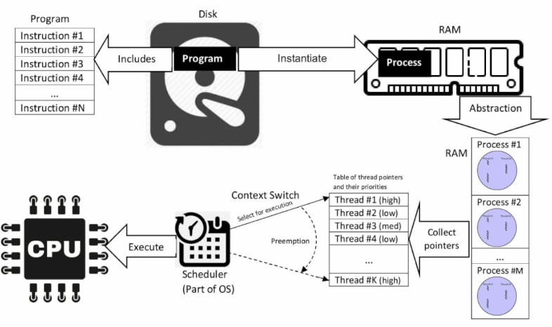

# 1) Problem with Thread / Request
## Traditional Thread / Request Programming

- 전통적 어플리케이션 프레임워크 : 앱/웹서버가 존재. 스레드 풀을 갖고 있다가 새 요청이 들어오면 해당 작업을 위한 스레드를 할당함
- 해당 접근법의 문제는 요청에 하나의 단일 스레드가 할당된다는 점
- ex) 데이터베이스 호출 -> 얻은 결과로 계산 -> 다른 테이블이나 파일 시스템에 결과 write 한다고 가정 :
	- 데이터베이스 호출, 파일 시스템 등의 IO 작업은 시간이 많이 걸리며, 해당 시간동안 스레드는 막히고 대기 상태로 유지됨
	- 각 스레드에는 최대 1MB의 스택 메모리를 할당해야 함. 1GB RAM이 있고 400개의 요청4이 동시 발생할 경우 400개의 스레드가 필요하며, 실제 작업에 필요한 메모리를 제외하고도 이 스레드들만을 위해 400MB의 RAM이 사용되게 될 것임

## Thread/Request In Microservices

- 현대 마이크로서비스 아키텍쳐 : 한 그룹의 마이크로서비스들이 서로 통신
- ex) 서비스 A가 요청을 받았고, 해당 요청은 서비스 B를 필요로 한다고 가정 :
	- 서비스 B가 데이터베이스 호출 및 계산을 할 동안, 서비스 B의 해당 스레드가 막힐 뿐만 아니라 서비스 B를 호출한 서비스 A의 스레드 또한 막혀있게 됨
	- 결국 모든 단계를 동기적 블락킹 방식(synchronous blocking)으로 수행하게 됨
- 동기적 블락킹 방식(synchronous blocking)으로 코드를 작성하는 것은 쉬움
- 하지만 이런 전통적인 요청별 스레드 방식(thread per request model)은 확장 가능한 솔루션이 아님
	- 처리 가능한 최대 동시 요청에 한계가 있으며, 시스템 리소스도 많이 사용

- 그렇다면 서버를 추가하여 들어오는 요청들을 해결한다면? -> 자원을 효율적으로 사용하는 방법은 아니며 우리는 더 나은 방법이 필요!

## Event-Driven Programming

- 이벤트 기반 프로그래밍(Event-Driven Programming)은 비동기 프로시저 호출(asynchronous procedure call)에 기반함
- 이벤트 루프(event loop)가 존재, 보통 CPU 코어 당 스레드 하나
	- 새 요청이 들어오면 큐에 추가되며, 이벤트 루프는 큐에서 작업을 읽어와서 수행
	- IO 작업을 해야 할 경우, 이벤트 루프는 IO 작업을 요청하겠지만 결과가 도착하기를 기다리지 않고 큐에서 다른 작업을 읽어와 시작함. 그리고 결과가 도착한 이후에 해당 작업을 이어서 함
- ex) username이 주어지면, 해당 username을 갖는 userId를 콘솔에 출력하는 작업을 한다고 가정 :
	- userId 가져오기 위해 데이터베이스 호출(IO 작업)해야 함.
	- 서버는 IO 작업 요청을 보내고 응답이 도착하기를 기다리지 않고 큐에 다른 작업 있다면 수행함.
	- 요청에 대한 응답이 도착하면(보통 OS나 다른 스레드 풀에서 도착했다고 알려줌) 보류되었던 작업(콜백) 실행하기 위해 큐에 집어넣음
	- 이벤트 루프가 큐에 있는 작업들을 수행해나가면서 결국 userId 출력

## Callback Hell!

- 만약 요청이 다음과 같다면? : username 기반으로 userId 얻기 -> 얻은 userId로 orderService에게 주문목록 얻어옴 -> 얻은 주문 목록으로 paymentService에게 결재 상태 얻어옴 ...
- 콜백 안의 콜백 안의 콜백 ... 형태가 됨
- 이러한 코드는 읽고 유지보수하기가 어려움 -> 더 나은 코드가 필요!

# 2) IO Models
## IO

- IO 모델 4종류 존재.
- 첫번째 모델 : synchronous(동기) + blocking
	- 우리가 디폴트로 사용해왔던 모델
	- 대부분의 시간 동안 스레드들은 차단되어 있고(blocked) 요청과 함께 대기 상태로 유지됨
	- ex) 보험사에 청구하기 위해 내가 전화를 걸어야 한다고 가정 :
		- 내가 직접 전화를 걸고 자동 시스템으로 연결됨 -> 시스템에서 눌러 달라는 번호를 누름 -> 담당 직원이 다른 고객 응대로 바쁘다는 메시지 받음 -> 5분간 기다림 -> 담당 직원이 전화 받음
		- 이 예시에서 내가 스레드이고 보험사가 remote service
		- 요청에 대한 답이 올 때까지 줄곧 차단된 상태로 단순 대기
- 두번째 모델 : asynchronous(비동기)
	- 

2. 
3. 
4. 
5. 
6. sync + blocking : 스레드들이 직접 요청 후 대기하면서 요청에 대한 답이 올 때까지 무한정 기다림.
7. async : 스레드가 직접 요청하는 대신 또 다른 스레드를 고용하여 요청을 대신 보내도록 하고, 그 동안 자신은 다른 일을 함. 요청을 필요로 하는 스레드는 비동기적으로 일처리를 하게 되지만, 요청을 대신 보내는 스레드는 1번 모델과 똑같은 sync + blocking 과정을 거치게 됨. 
8. non-blocking : = event driven model. low level 코딩을 필요로 하며 2번 모델보다 구현이 어려움. 스레드는 요청을 직접 보내고 이 요청이 처리되는 동안 다른 일을 하고 있고(not blocked), 요청에 대한 결과가 완료되면 OS가 스레드에게 이를 알려줌.
9. non-blocking + async :