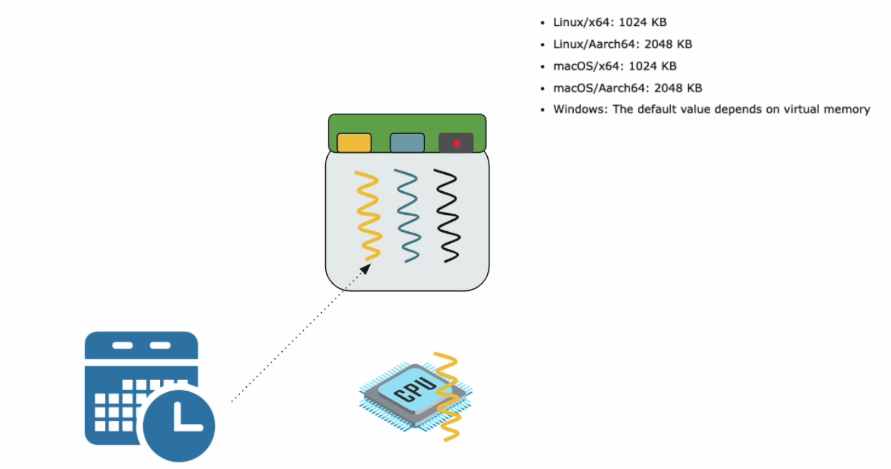

## Problem with Thread / Request
### Traditional Thread / Request Programming

- 전통적 어플리케이션 프레임워크 : 앱/웹서버가 존재. 스레드 풀을 갖고 있다가 새 요청이 들어오면 해당 작업을 위한 스레드를 할당함
- 해당 접근법의 문제는 요청에 하나의 단일 스레드가 할당된다는 점
- ex) 데이터베이스 호출 -> 얻은 결과로 계산 -> 다른 테이블이나 파일 시스템에 결과 write 한다고 가정 :
	- 데이터베이스 호출, 파일 시스템 등의 IO 작업은 시간이 많이 걸리며, 해당 시간동안 스레드는 막히고 대기 상태로 유지됨
	- 각 스레드에는 최대 1MB의 스택 메모리를 할당해야 함. 1GB RAM이 있고 400개의 요청4이 동시 발생할 경우 400개의 스레드가 필요하며, 실제 작업에 필요한 메모리를 제외하고도이 스레드들만을 위해 400MB의 RAM이 사용되게 될 것임

### Thread/Request In Microservices

- 현대 마이크로서비스 아키텍쳐 : 한 그룹의 마이크로서비스들이 서로 통신
- ex) 서비스 A가 요청을 받았고, 해당 요청은 서비스 B를 필요로 한다고 가정 :
	- 서비스 B가 데이터베이스 호출 및 계산을 할 동안, 서비스 B의 해당 스레드가 막힐 뿐만 아니라 서비스 B를 호출한 서비스 A의 스레드 또한 막혀있게 됨
	- 결국 모든 단계를 동기적 블락킹 방식(synchronous blocking)으로 수행하게 됨
- 동기적 블락킹 방식(synchronous blocking)으로 코드를 작성하는 것은 쉬움
- 하지만 이런 전통적인 요청별 스레드 방식(thread per request model)은 확장 가능한 솔루션이 아님
	- 처리 가능한 최대 동시 요청에 한계가 있으며, 시스템 리소스도 많이 사용

- 그렇다면 서버를 추가하여 들어오는 요청들을 해결한다면? -> 자원을 효율적으로 사용하는 방법은 아니며 우리는 더 나은 방법이 필요!

### Event-Driven Programming

- 이벤트 기반 프로그래밍(Event-Driven Programming)은 비동기 프로시저 호출(asynchronous procedure call)에 기반함
- 

## IO Models

1. sync + blocking : 스레드들이 직접 요청 후 대기하면서 요청에 대한 답이 올 때까지 무한정 기다림.
2. async : 스레드가 직접 요청하는 대신 또 다른 스레드를 고용하여 요청을 대신 보내도록 하고, 그 동안 자신은 다른 일을 함. 요청을 필요로 하는 스레드는 비동기적으로 일처리를 하게 되지만, 요청을 대신 보내는 스레드는 1번 모델과 똑같은 sync + blocking 과정을 거치게 됨. 
3. non-blocking : = event driven model. low level 코딩을 필요로 하며 2번 모델보다 구현이 어려움. 스레드는 요청을 직접 보내고 이 요청이 처리되는 동안 다른 일을 하고 있고(not blocked), 요청에 대한 결과가 완료되면 OS가 스레드에게 이를 알려줌.
4. non-blocking + async :