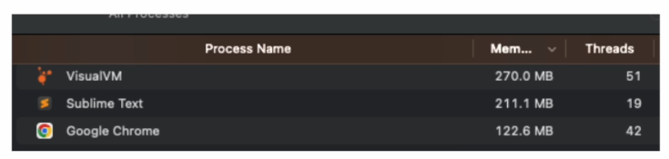
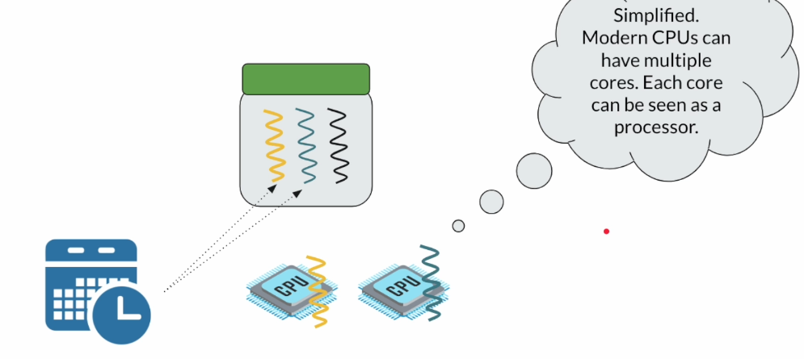

# 2) Process / Thread / CPU / RAM / Scheduler
## Process

- 당신이 단순한 자바 어플리케이션을 개발하여 JAR 파일로 패키징했다고 가정
- JAR 파일은 디스크의 어딘가에 저장. 현재 당신의 프로그램은 한 셋의 명령어들에 불과
- JAR 파일을 커맨드로 실행시키면 메모리에 로드되어 프로세스가 생성됨
	- 프로세스 : 독립된 메모리 공간을 가진 컴퓨터 프로그램의 인스턴스. 코드, 자원들(OS가 할당한 메모리, 소켓 등)을 포함함

## Thread

- 스레드는 프로세스의 일부
- 프로세스에는 최소한 하나의 스레드가 포함됨
- 프로세스 안의 스레드들은 프로세스에 OS가 할당한 메모리 공간 공유 가능
- 프로세스는 자원의 단위(unit of resources), 스레드는 실행의 단위(unit of execution)

## Scheduler / CPU / Thread

- 운영체제는 스케줄러라는 것을 갖고 있음
- 스케줄러는 실행을 위해 스레드에 CPU(프로세서)를 할당하며, 스레드가 실행 가능한 시간(CPU 할당받는 시간)을 결정함
- 한 CPU에 여러 스레드를 switch해가며 할당하거나, CPU가 여러개라면 한 CPU 당 한 스레드를 병렬적으로 할당시키거나 하는 방법들을 사용해 할당함
- 현대의 CPU는 여러 코어들로 구성되는데, 이 경우엔 각 코어는 서로 다른 프로세서로 볼 수 있음

## Process / Thread / Scheduler / RAM / CPU

- 여러 프로세스들을 동시에 실행시킬 경우 각 프로세스들은 스레드들을 가짐
- 스레드들은 CPU를 할당받기 위해 경쟁하며, OS 스케줄러는 실행을 위해 스레드 간에 전환을 계속함 = context switch
- 한 스레드에서 다른 스레드로 전환할 경우 이전 스레드의 실행 시점과 상태가 추후 실행 시 재개될 수 있도록 저장되어 있어야 함.
- 해당 스레드들을 커널 스레드 or OS 스레드라고 부름

## Java(Platform) Thread
- 자바 스레드는 단순히 OS 스레드를 감싼 것(wrapper)
- 따라서 1 자바 스레드 = 1 OS 스레드
- OS 스레드는 스케줄링의 단위(unit of scheduling)이며, 프로세서를 할당받아 실행됨
- OS 스레드를 통해서만 

# 3) IO Models
## IO
- IO 모델 4종류 존재.
- 첫번째 모델 : synchronous(동기) + blocking
	- 우리가 예전부터 사용해왔던 모델
	- 대부분의 시간 동안 스레드들은 차단되어 있고(blocked) 요청과 함께 대기 상태로 유지됨
	- ex) 보험사에 청구하기 위해 내가 전화를 걸어야 한다고 가정 :
		- 내가 직접 전화를 걸고 자동 시스템으로 연결됨 -> 시스템에서 눌러 달라는 번호를 누름 -> 담당 직원이 다른 고객 응대로 바쁘다는 메시지 받음 -> 5분간 기다림 -> 담당 직원이 전화 받음
		- 이 예시에서 내가 스레드이고 보험사가 remote service
		- 요청에 대한 답이 올 때까지 줄곧 차단된 상태로 단순 대기
- 두번째 모델 : asynchronous(비동기)
	- 

2. 
3. 
4. 
5. 
6. sync + blocking : 스레드들이 직접 요청 후 대기하면서 요청에 대한 답이 올 때까지 무한정 기다림.
7. async : 스레드가 직접 요청하는 대신 또 다른 스레드를 고용하여 요청을 대신 보내도록 하고, 그 동안 자신은 다른 일을 함. 요청을 필요로 하는 스레드는 비동기적으로 일처리를 하게 되지만, 요청을 대신 보내는 스레드는 1번 모델과 똑같은 sync + blocking 과정을 거치게 됨. 
8. non-blocking : = event driven model. low level 코딩을 필요로 하며 2번 모델보다 구현이 어려움. 스레드는 요청을 직접 보내고 이 요청이 처리되는 동안 다른 일을 하고 있고(not blocked), 요청에 대한 결과가 완료되면 OS가 스레드에게 이를 알려줌.
9. non-blocking + async :