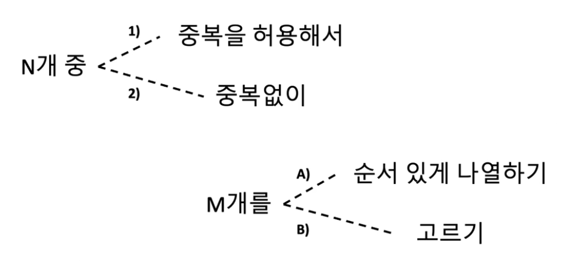

### 완전 탐색이란
- 문제 해결 위해 확인해야 하는 `모든 경우를 전부 탐색`하는 방법
- 단순 for문 사용뿐만 아니라, 재귀함수, `백트래킹` 통해 문제 푸는 상황 포함
- 모든 코테 문제에서 `가장 기본적으로 접근해봐야하는 방식`
- 장점 : 부분점수 얻기 좋음
- 단점 : 전부 탐색하기 때문에 시간 복잡도 일반적으로 높음

### 코딩 테스트에 나오는 완전 탐색 종류


### 완전 탐색 함수 정의
```java
// Recursive Function (재귀 함수)
// 만약 M개를 전부 고름 => 조건에 맞는 탐색을 한가지 성공한 것
// 아직 M개를 고르지 않음 => k번째부터 M번째 원소를 조건에 맞게 고르는 모든 방법을 시도함
static void recFunc(int k) {}

public static void main(String[] args){
	input();
	// 1번째 원소부터 M번째 원소를 조건에 맞게 고르는 모든 방법을 탐색
	recFunc(1);
	System.out.println(sb.toString());
}
```

### N개 중 `중복을 허용해서` M개를 `순서있게 나열하기`
- 문제 : [BOJ 15651 - N과M(3)](https://www.acmicpc.net/problem/15651)
- 자연수 N과 M이 주어졌을 때, 1부터 N까지 자연수 중에서 중복을 허용하여 M개를 고른 수열을 모두 구하는 문제
- N=4, M=3일 경우, $4X4X4 = 4^3$ -> 시간복잡도는 $O(N^M)$
- 문제의 조건이 $1 \leq M \leq N \leq 7$ 이므로, 가장 값이 커질 수 있는 경우는 $7^7$ = 약 82만. 1초에 1억번의 연산 가능하다고 했을 때 1초 안에 충분히 문제 풀 수 있음
- 표현해야하는 숫자가 총 M개 -> 공간복잡도는 $O(M)$ 
<br/>

- 구현 스케치 :
```java
static int N, M;
static int[] selected;
// Recursive Function (재귀 함수)
// 만약 M개를 전부 고름 => 조건에 맞는 탐색을 한가지 성공한 것
// 아직 M개를 고르지 않음 => k번째부터 M번째 원소를 조건에 맞게 고르는 모든 방법을 시도함
static void recFunc(int k) {
	if(k == M+1) { // 다 골랐다!
		// selected[1...M] 배열이 새롭게 탐색된 결과
	} else {
		// 1~N까지를 k번 원소로 한 번씩 정하고,
		// 매번 k+1번부터 M번 원소로 재귀호출 해주기
	}
}
```
<br/>

- 실제 구현 : 
```java
import java.io.*;
import java.util.*;

public class Main {

	static StringBuilder sb = new StringBuilder();
	static int N, M;
	static int[] selected;

	static void input() {
		FastReader reader = new FastReader();
		N = reader.nextInt();
		M = reader.nextInt();
		selected = new int[M+1];
	}

	// Recursive Function (재귀 함수)
	// 만약 M 개를 전부 고름 => 조건에 맞는 탐색을 한 가지 성공한 것!
	// 아직 M 개를 고르지 않음 => k 번째부터 M번째 원소를 조건에 맞게 고르는 모든 방법을 시도한다
	static void recFunc(int k) {
		if(k == M+1) { // 다 골랐다!
			// selected[1...M] 배열이 새롭게 탐색된 결과
			for(int i=1; i<=M; i++){
				sb.append(selected[i]).append(' ');
			}
			sb.append('\n');
		} else {
			for(int c=1; c<=N; c++){
				// k번째에 c(candidate)가 올 수 있으므로 대입
				selected[k] = c;
				// k+1번부터 M번까지 잘 채워주는 함수를 호출해준다
				recFunc(k+1);
			}
		}
	}

	public static void main(String[] args) {
		input();
		
		// 1번째 원소부터 M번째 원소를 조건에 맞게 고르는 모든 방법을 탐색
		recFunc(1);
		
		System.out.println(sb.toString());
	}

	static class FastReader {
	
		BufferedReader br;
		StringTokenizer st;
	
		public FastReader() {
			br = new BufferedReader(new InputStreamReader(System.in));
		}
		
		String next() {
			while(st == null || !st.hasMoreTokens()) {
				try {
					st = new StringTokenizer(br.readLine());
				} catch (IOException e) {
					e.printStackTrace();
				}
			}
			return st.nextToken();
		}
		
		int nextInt() {
			return Integer.parseInt(next());
		}

		long nextLong() {
			return Long.parseLong(next());
		}

		double nextDouble() {
			return Double.parseDouble(next());
		}
	
		String nextLine() {
			String str = "";
			try {
				str = br.readLine();
			} catch (IOException e) {
				e.printStackTrace();
			}
			return str;
		}
	}
}
``` 

<br/>

>##### 📚 참고 : StringTokenizer
>- 문자열을 여러 개의 토큰으로 분리하는 클래스
>```
>// 1) 띄어쓰기 기준 문자열 분리
>StringTokenizer st = new StringTokenizer(문자열);
>// 2) 구분자 기준 문자열 분리
>StringTokenizer st = new StringTokenizer(문자열, 구분자);
>// 3) 구분자 기준 분리 시, 구분자도 토큰으로 포함 X (default)
>StringTokenizer st = new StringTokenizer(문자열, 구분자, false);
>// 4) 구분자 기준 분리 시, 구분자도 토큰으로 포함 O
>StringTokenizer st = new StringTokenizer(문자열, 구분자, true);
>
>// 남아있는 토큰이 있을 경우, 다음 토큰 출력
>while (st.hasMoreTokens()) {
>	System.out.println(st.nextToken());
>}
>``` 

<br/>

### N개 중 `중복 없이` M개를 `순서있게 나열하기`
- 문제 : [BOJ 15649 - N과 M(1)](https://www.acmicpc.net/problem/15649)
- 자연수 N과 M이 주어졌을 때, 1부터 N까지 자연수 중에서 중복 없이 M개를 고른 수열을 모두 구하는 문제
- N=4, M=3일 경우, $4X3X2 = 4!$ -> 시간복잡도는 $O(_{N}P_{M}) = O(\dfrac{N!}{(N - M)!})$
- 문제의 조건이 $1 \leq M \leq N \leq 8$ 이므로, 가장 값이 커질 수 있는 경우는 N=8, M=8일 때이며 $\dfrac{8!}{0!}$ = 40320. 1초에 1억번의 연산 가능하다고 했을 때 1초 안에 가능
- 표현해야하는 숫자가 총 M개 -> 공간복잡도는 $O(M)$
<br/>

- 구현 :
``` java
import java.io.*;
import java.util.*;

public class Main {
    static StringBuilder sb = new StringBuilder();
    static int N, M;
    static int[] selected;
    static boolean[] chk;

    static void input() {
        FastReader reader = new FastReader();
        N = reader.nextInt();
        M = reader.nextInt();
        selected = new int[M+1];
        chk = new boolean[N+1];
    }

    static void recFunc(int k) {
        if(k == M+1) {
            for(int i=1; i<=M; i++) {
                sb.append(selected[i]).append(' ');
            }
            sb.append('\n');
        } else {
            for(int c=1; c<=N; c++) {
                // c(candidate)가 이미 사용되었으면 스킵
                if(chk[c]) continue;
                // k번째에 c(candidate)가 올 수 있으면
                selected[k] = c;
                chk[c] = true;
                recFunc(k+1);
                chk[c] = false;
            }
        }
    }
    
    public static void main(String[] args) {
        input();

        recFunc(1);

        System.out.println(sb.toString());
    }

    static class FastReader {
        BufferedReader br;
        StringTokenizer st;

        public FastReader() {
            br = new BufferedReader(new InputStreamReader(System.in));
        }

        String next() {
            while(st == null || !st.hasMoreTokens()) {
                try {
                    st = new StringTokenizer(br.readLine());
                } catch (IOException e) {
                    e.printStackTrace();
                }
            }
            return st.nextToken();
        }

        int nextInt() {
            return Integer.parseInt(next());
        }

        long nextLong() {
            return Long.parseLong(next());
        }

        double nextDouble() {
            return Double.parseDouble(next());
        }

        String nextLine() {
            String str = "";
            try {
                str = br.readLine();
            } catch (IOException e) {
                e.printStackTrace();
            }
            return str;
        }
    }
}
``` 

### N개 중 `중복을 허용해서` M개를 `고르기`
- 문제 : [BOJ 15652 - N과 M(4)](https://www.acmicpc.net/problem/15652)
- 자연수 N과 M이 주어졌을 때, 1부터 N까지 자연수 중에서 중복을 허용해서 M개를 고르는 문제 (비내림차순 수열 == 중복 허용 고르기 문제)
- N=4, M=3일 경우, 첫번째 칸에 올 수 있는 숫자는 4개. 두번째 칸에 올 수 있는 숫자는 첫번째 칸의 숫자가 1이면 4개, 2면 3개, 3이면 2개, 4면 1개 이므로, 4개 이하. 세번째 칸에 올 수 있는 숫자도 같은 방식으로 4개 이하. -> $4X4X4 = 4^3$ 보단 작다
- 어차피 시간복잡도로는 크게 차이가 생기지 않아서 $O(N^M)$ 보다는 작거나 같으니까 시간복잡도는 대략 $O(N^M)$
- 문제의 조건이 $1 \leq M \leq N \leq 8$ 이므로, 가장 값이 커질 수 있는 경우는 N=8, M=8일 때이며 $8^8 \cong 1677만$ 보단 작다고 할 수 있음. 1초에 1억번의 연산 가능하다고 했을 때 1초 안에 가능
- 표현해야하는 숫자가 총 M개 -> 공간복잡도는 $O(M)$ 
<br/>

- 구현 :
``` java
import java.io.*;
import java.util.*;

public class Main {

    static StringBuilder sb = new StringBuilder();
    static int N, M;
    static int[] selected;

    static void input() {
        FastReader reader = new FastReader();
        N = reader.nextInt();
        M = reader.nextInt();
        selected = new int[M+1];
    }

    static void recFunc(int k) {
        if(k == M+1) {
            for(int i = 1; i <= M; i++) {
                sb.append(selected[i]).append(' ');
            }
            sb.append('\n');
        } else {
            int start = k == 1 ? 1 : selected[k-1];
            for(int c = start; c <= N; c++) {
                selected[k] = c;
                recFunc(k+1);
            }
        }
    }

    public static void main(String[] args) {
        input();

        recFunc(1);

        System.out.println(sb.toString());
    }

    static class FastReader {
        BufferedReader br;
        StringTokenizer st;

        public FastReader() {
            br = new BufferedReader(new InputStreamReader(System.in));
        }

        String next() {
            while(st == null || !st.hasMoreTokens()) {
                try {
                    st = new StringTokenizer(br.readLine());
                } catch (IOException e) {
                    e.printStackTrace();
                }
            }
            return st.nextToken();
        }

        int nextInt() {
            return Integer.parseInt(next());
        }

        long nextLong() {
            return Long.parseLong(next());
        }

        double nextDouble() {
            return Double.parseDouble(next());
        }

        String nextLine() {
            String str = "";
            try {
                str = br.readLine();
            } catch (IOException e) {
                e.printStackTrace();
            }
            return str;
        }
    }
}
``` 

### N개 중 `중복 없이` M개를 `고르기`
- 문제 : [BOJ 15650 - N과 M(2)](https://www.acmicpc.net/problem/15650)
- 자연수 N과 M이 주어졌을 때, 1부터 N까지 자연수 중에서 중복 없이 M개를 고르는 문제 (오름차순 수열 == 중복 없이 고르기 문제)
- 시간복잡도는 $O(_{N}C_{M}) = O(\dfrac{N!}{(N - M)!M!})$
- 문제의 조건이 $1 \leq M \leq N \leq 8$ 이므로, 가장 값이 커질 수 있는 경우는 N=8, M=4일 때이며, $\dfrac {8!}{4!4!} = 70$. 1초에 1억번의 연산 가능하다고 했을 때 1초 안에 가능
- 표현해야하는 숫자가 총 M개 -> 공간복잡도는 $O(M)$
<br/>

- 구현 :
``` java
import java.io.*;
import java.util.*;

public class Main {

    static StringBuilder sb = new StringBuilder();
    static int N, M;
    static int[] selected;

    static void input() {
        FastReader reader = new FastReader();
        N = reader.nextInt();
        M = reader.nextInt();
        selected = new int[M+1];
    }

    static void recFunc(int k) {
        if(k == M+1) {
            for(int i = 1; i <= M; i++) {
                sb.append(selected[i]).append(' ');
            }
            sb.append('\n');
        } else {
            for(int c = selected[k-1] + 1; c <= N; c++) {
                selected[k] = c;
                recFunc(k+1);
            }
        }
    }

    public static void main(String[] args) {
        input();

        recFunc(1);

        System.out.println(sb.toString());
    }

    static class FastReader {
        BufferedReader br;
        StringTokenizer st;

        public FastReader() {
            br = new BufferedReader(new InputStreamReader(System.in));
        }

        String next() {
            while(st == null || !st.hasMoreTokens()) {
                try {
                    st = new StringTokenizer(br.readLine());
                } catch (IOException e) {
                    e.printStackTrace();
                }
            }
            return st.nextToken();
        }

        int nextInt() {
            return Integer.parseInt(next());
        }

        long nextLong() {
            return Long.parseLong(next());
        }

        double nextDouble() {
            return Double.parseDouble(next());
        }

        String nextLine() {
            String str = "";
            try {
                str = br.readLine();
            } catch (IOException e) {
                e.printStackTrace();
            }
            return str;
        }
    }
}
``` 

### 완전탐색 - 총 정리
| 중복  | 순서  | 시간 복잡도                                     | 공간 복잡도 |
| --- | --- | ------------------------------------------ | ------ |
| O   | O   | $O(N^M)$                                   | $O(M)$ |
| X   | O   | $O(_{N}P_{M}) = O(\dfrac{N!}{(N - M)!})$   | $O(M)$ |
| O   | X   | $O(N^M)$ 보단 작음                             | $O(M)$ |
| X   | X   | $O(_{N}C_{M}) = O(\dfrac{N!}{(N - M)!M!})$ | $O(M)$ |
- 완전 탐색 문제 접근할 때는,
	- 고를 수 있는 값의 종류 파악
	- `중복` 허용하는 지 확인
	- `순서` 중요한 지 확인 (나열 or 고르기)

### 응용문제
- [BOJ 14888 - 연산자 끼워넣기](https://www.acmicpc.net/problem/14888)
- 