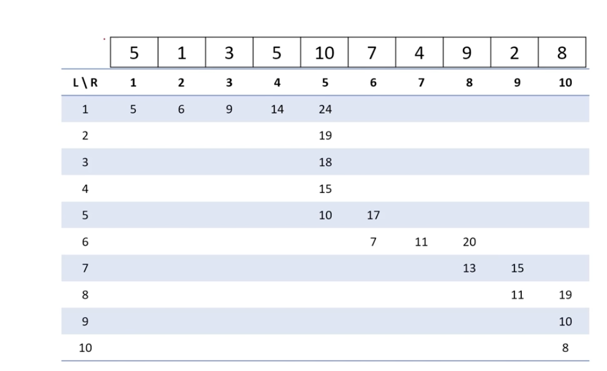

<br/>

### 두 포인터(Two Pointers)
- 화살표 두 개에 의미를 부여해서 탐색 범위를 압축하는 방법
- 두 포인터 문제 종류 :
	1. 1차원 배열 위에 2개의 포인터를 만드는 경우
		1) 2개의 포인터가 모두 왼쪽에서 시작해서 `같은 방향`으로 이동
		2) 2개의 포인터가 양 끝에서 `서로를 향해` 이동
	2. 관찰을 통해서 문제에 등장하는 `변수 2개의 값`을 두 포인터로 표현하는 경우

### 두 포인터 문제 키워드
1. 1차원 배열에서의 `"연속 부분 수열"` or `"순서를 지키며 차례대로"`
2. `"곱의 최소"` 
	- ex) A * B가 최소가 되려면, 이전의 곱보다 A가 커지면 B는 작아져야만 함. 

-> 이런 단어가 등장하면 두 포인터 접근 시도해 볼 가치가 있음!

### 예시 문제 1
- [BOJ 1806 - 부분합](https://www.acmicpc.net/problem/1806)
- 두 포인터 방법 시간복잡도 :
	
	1. 왼쪽 시작 L의 이동 횟수 N번
	2. 오른쪽 끝 R을 이전의 R부터 시작해서 이동
	3. L, R이 최대 N번 이동하니까, O(N)

- 중요 포인트) L=2 일 때, 인덱스 2~4 부분합 15 이상 되는지 확인하지 않아도 되는 이유 : L=2 일 때 인덱스 2~4 부분합은 L=1 일 때 부분합에서 arr[1] = 5 값을 뺀 값이 됨. L=1 일 때도 인덱스 2~4 일 때 부분합이 15 이상이 되지 못했는데 거기서 -5 한 값이 15 이상이 될리 없음. 따라서 이전에 15 이상이 된 인덱스부터만 보면 됨!

- 구현 스케치 : 
``` java
// L : 구간의 왼쪽 끝, R : 구간의 오른쪽 끝
// sum : [L ... R] 구간의 합
// 인덱스는 1부터 시작 (L - 1 구간 제외 시 인덱스 0 필요)

static void pro() {
	int R = 0, sum = 0, ans = n + 1;
	for (int L = 1; L <= n; L++) {
		// 1) L - 1 을 구간에서 제외하기

		// 2) R을 옮길 수 있을 때 까지 옮기기 (R+1이 배열 범위 안에 있는지도 체크!)

		// 3) [L ... R] 의 합, 즉 sum이 조건을 만족하면 정답 갱신
	}

	// ans 값을 보고 불가능 판단하기
	System.out.println(ans);
}

```

- 구현 : 
``` java
import java.io.*;
import java.util.*;

public class Main {

    // 부분합이 S 이상 되는것 중 가장 짧은 길이 출력, 불가능하다면 0 출력.
    // 10 <= N < 10만, 0 < S <= 1억, 수열의 각 원소 <= 10000
    // 최대최소값 : 수열 길이 < 10만, 수들의 부분합 <= 10억 -> int
    // 시간복잡도 : L과 R이 최대 N번 이동하여 O(2N) -> 결국 O(N). 최대 < 10만

    static int N, S;
    static int[] arr;

    static void input() {
        FastReader reader = new FastReader();
        N = reader.nextInt();
        S = reader.nextInt();
        arr = new int[N+1];
        for(int i=1; i<=N; i++) {
            arr[i] = reader.nextInt();
        }
    }

    static int solution() {
        int R = 0, sum = 0, ans = N+1;
        for(int L = 1; L <= N; L++) {
	        // L - 1 을 구간에서 제외
            sum -= arr[L-1];
            // R을 옮길 수 있을 때 까지 옮기기
            // R의 범위가 벗어날 수 있음 주의!
            while(sum < S && R + 1 <= N) {
                sum += arr[++R];
            }
            // [L ... R] 의 합, 즉 sum이 조건을 만족하면 정답 갱신
            // 배열 끝부분에 와서는 sum이 S이상이 되지 못하고 부분합이 끝나는 경우도 있기 때문에 한번 더 걸러줘야 함!
            if(sum >= S) {
                ans = Math.min(ans, R - L + 1);
            }   
        }
        // ans 값을 보고 불가능 판단
        if(ans == N+1) return 0;
        return ans;
    }

    public static void main(String[] args) {
        input();
        System.out.println(solution());
    }

    static class FastReader {
        BufferedReader br;
        StringTokenizer st;

        public FastReader() {
            br = new BufferedReader(new InputStreamReader(System.in));
        }

        String next() {
            while(st == null || !st.hasMoreTokens()) {
                try {
                    st = new StringTokenizer(br.readLine());
                } catch (IOException e) {
                    e.printStackTrace();
                }
            }
            return st.nextToken();
        }

        int nextInt() {
            return Integer.parseInt(next());
        }

        long nextLong() {
            return Long.parseLong(next());
        }

        double nextDouble() {
            return Double.parseDouble(next());
        }

        String nextLine() {
            String str = "";
            try {
                str = br.readLine();
            } catch (IOException e) {
                e.printStackTrace();
            }
            return str;
        }
    }
}
```

### 예시 문제 2
- [BOJ 2470 - 두 용액](https://www.acmicpc.net/problem/2470)
- 

### 연습 문제
- [BOJ 2003 - 수들의 합 2](https://www.acmicpc.net/problem/2003)
- [BOJ 2559 - 수열](https://www.acmicpc.net/problem/2559)
- [BOJ 15565 - 귀여운 라이언](https://www.acmicpc.net/problem/15565)
- [BOJ 11728 - 배열 합치기](https://www.acmicpc.net/problem/11728)
- [BOJ 2230 - 수 고르기](https://www.acmicpc.net/problem/2230)

