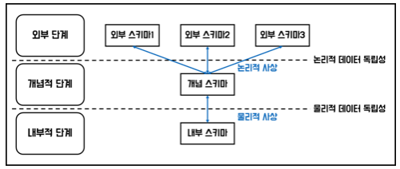
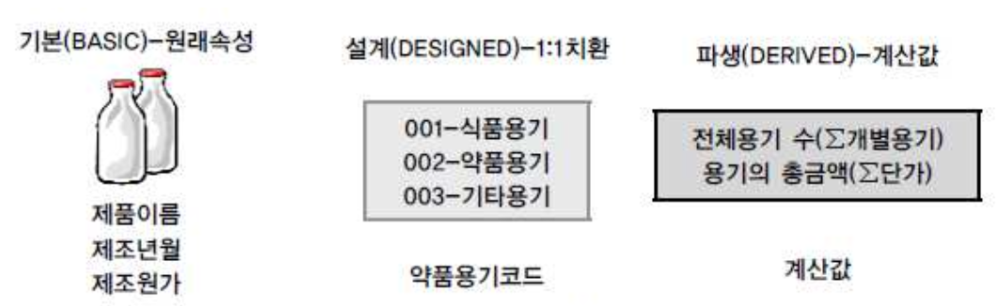

```table-of-contents
```

### 1. 데이터 모델의 이해
#### 데이터 모델링이란
- 정보시스템을 구축하기 위한 데이터 관점의 업무 분석 기법
- 현실 세계의 데이터를 약속된 표기법으로 표현하는 과정
- 데이터베이스를 구축하기 위한 분석 및 설계의 과정
- 데이터 모델링 3요소 : `엔터티, 관계, 속성`

#### 데이터 모델링의 목적
 1) 업무정보를 구성하는 기초 정보들을 `일정한 표기법`으로 표현하여 정보시스템 구축의 대상이 되는 `업무 내용을 정확하게 분석`하는 것
2) 분석된 모델로 `실제 데이터베이스를 생성`하여 개발 및 데이터관리에 사용하기 위한 것
- 데이터 모델링은 `단지 데이터베이스 구축/시스템 구현만을 위해 수행하는 태스크가 아니며`, 업무분석 및 업무형상화를 하는 목적도 있음

#### 데이터 모델링 유의점
- 데이터 모델링을 할 때 유의할 사항 : 중복성, 비유연성, 비일관성
1) `중복성` : 
	- 데이터 모델은 같은 데이터를 사용하는 사람, 시간, 그리고 장소를 파악하는 데 도움을 주어 데이터베이스가 `여러 장소의 데이터베이스에 같은 정보를 저장하지 않도록` 하여 중복성을 최소화
2) `비유연성` : 
	- 데이터 모델을 어떻게 설계했느냐에 따라 사소한 업무변화에도 데이터 모델이 수시로 변경되어 유지보수의 어려움을 가중시킬 수 있음
	- `데이터의 정의를 데이터의 사용 프로세스와 분리`함으로써 데이터 모델링은 데이터 혹은 프로세스의 작은 변화가 애플리케이션과 데이터베이스에 중대한 변화를 일으킬 수 있는 가능성을 줄이고 유연성을 높임
3) `비일관성` : 
	- 데이터 중복이 없더라도 비일관성은 발생할 수 있는데, 예를 들면 신용 상태에 대한 갱신 없이 고객의 납부 이력 정보를 갱신하는 경우. 개발자가 서로 연관된 다른 데이터와 모순된다는 고려 없이 일련의 데이터를 수정할 수 있기 때문
	- 데이터 모델링을 할 때 `데이터 간의 상호 연관 관계에 대해 명확히 정의`한다면 일관성 있게 데이터가 유지되도록 할 수 있음
	- 사용자가 처리하는 프로세스 혹은 이와 관련된 `프로그램과 테이블의 연계성을 높이는 것은 데이터 모델이 업무 변경에 대해 취약하게 만드는 단점`에 해당

#### 데이터베이스 스키마 구조 3단계
 
- 데이터베이스 스키마 구조는 3단계로 구분 : 외부 스키마, 개념 스키마, 내부 스키마
1) `외부스키마` :
	- `View 단계` 
	- `여러 사용자 관점으로 구성`
	- 개별 사용자 단계로서 각 사용자가 보는 개인적 DB 스키마
	- DB의 각 사용자나 응용프로그래머가 접근하는 DB 정의
2) `개념스키마` : 
	- 개념단계. 하나의 개념적 스키마로 구성
	- `모든 사용자 관점을 통합`한 조직 전체 관점의 통합적 표현
	- 모든 응용시스템들이나 사용자들이 필요로 하는 데이터를 통합한 조직 전체의 DB를 기술한 것으로 DB에 저장되는 데이터와 그들간의 관계를 표현하는 스키마
3) `내부스키마` : 
	- 내부단계. DB가 물리적으로 저장된 형식
	- `물리적 장치에서 데이터가 실제적으로 저장되는 방법(물리적인 저장구조)`을 표현하는 스키마
- 데이터 모델링은 통합관점의 뷰를 가지고 있는 개념 스키마를 만들어가는 과정으로 이해 가능

#### 스키마 독립성
- 3단계로 개념이 분리되면서 각각의 영역에 대한 독립성을 지정하는 용어 -> 논리적 독립성, 물리적 독립성
 1) `논리적 독립성` :
	- 내용 : 
		- `개념 스키마가 변경되어도 외부 스키마에는 영향을 미치지 않도록` 하는 것
		- 논리적 구조가 변경되어도 응용 프로그램에 영향 없음
	- 특징 : 
		- 사용자 특성에 맞는 변경가능
		- 통합 구조 변경가능
 2) `물리적 독립성` : 
	- 내용 :
		- `내부스키마가 변경되어도 외부/개념 스키마는 영향을 받지 않도록` 하는 것
		- 저장장치의 구조변경은 응용프로그램과 개념스키마에 영향 없음
	- 특징 : 
		- 물리적 구조 영향 없이 개념 구조 변경 가능
		- 개념 구조 영향 없이 물리적 구조 변경 가능

#### ERD(Entity Relationship Diagram)
- 1976년 피터첸에 의해 Entity-Relationship Model(E-R Model)이라는 표기법이 만들어짐
- 엔터티는 사각형, 관계를 마름모, 속성은 타원형으로 표현
- ERD 작성 순서 : `엔터티 도출 -> 엔터티 배치 -> 엔터티 간 관계 설정 -> 관계명 기술 -> 관계차수 표현 : 1:1, 1:N, M:N -> 관계선택사양 표현 : 필수, 선택`
- 일반적으로 사람의 눈은 왼쪽 -> 오른쪽, 위쪽 -> 아래쪽으로 이동하는 경향이 있기 때문에, 데이터 모델링에서도 가장 중요한 엔터티를 `왼쪽 상단`에 배치하고, 이것을 중심으로 다른 엔터티를 나열하면서 전개하면 사람의 눈이 따라가기에 편리한 데이터 모델을 작성 가능

### 2. 엔터티
#### 엔터티의 특징
1) 반드시 `해당 업무에서 필요하고 관리하고자 하는 정보`이어야 함 (ex. 환자, 토익의 응시횟수, ...)
2) `유일한 식별자에 의해 식별이 가능`해야 함
3) 영속적으로 존재하는, 1개가 아니라 `2개 이상의 인스턴스의 집합`이어야 함 (엔터티는 `2개 이상의 속성과 2개 이상의 인스턴스`를 가져 소위 면적으로 표현될 수 있어야 함)
4) 엔터티는 `업무 프로세스에 의해 이용되어야` 함
5) 엔터티는 `반드시 속성이 있어야` 함
6) 엔터티는 `다른 엔터티와 최소 한 개 이상의 관계가 있어야` 함 (단, 통계성 엔터티나 코드성 엔터티의 경우 관계 생략 가능)

#### 엔터티의 종류
- 유무형에 따른 분류 : 
	 1) 유형 엔터티 : 물리적 형태가 있고 지속적으로 활용되는 엔터티
	 2) 개념 엔티티 : 물리적 형태가 없는 엔터티

- `발생시점`에 따른 분류 : 
	1) `기본 엔터티(Fundamental/Key Entity)` : 
		- 그 업무에 원래 존재하는 정보
		- 다른 엔터티와 관계에 의해 생성되지 않고 독립적으로 생성이 가능하고 자신은 타 엔터티의 부모 역할을 하게 됨
		- 다른 엔터티로부터 주식별자를 상속받지 않고 자신의 고유한 주식별자 갖게 됨
		- ex) 사원, 부서, 고객, 상품, 자재 등
	 2) `중심 엔터티(Main Entity)` : 
		- 기본 엔터티로부터 발생되고 그 업무에 있어서 중심적인 역할을 함
		- 데이터의 양이 많이 발생되고 다른 엔터티와의 관계를 통해 많은 행위 엔터티를 생성함
		- ex) 계약, 사고, 예금원장, 청구, 주문, 매출 등
	 3) `행위 엔터티(Active Entity)` : 
		- 2개 이상의 부모 엔터티로부터 발생 
		- 자주 내용이 바뀌거나 데이터량이 증가됨. 지속적으로 정보가 추가되고 변경되어 데이터양이 가장 많음
		- 비즈니스 프로세스를 실행하면서 생성되는 엔터티
		- 분석 초기 단계에서는 잘 나타나지 않으며 상세 설계 단계나 프로세스와 상관모델링을 진행하면서 도출될 수 있음
		- ex) 주문목록, 사원변경이력 등

#### 엔터티 명명 기준
- `현업 업무에서 사용하는 용어 사용`
- `약어 사용 x`
- `단수명사 사용`
- `모든 엔터티를 통틀어서 유일한 이름이 부여`되어야 함
- `엔터티가 생성되는 의미대로 자연스럽게 이름을 부여`해야 함

#### 엔터티, 인스턴스, 속성, 속성값의 관계
- 한 개의 엔터티는 `2개 이상의 인스턴스 집합`이어야 함
- 한 개의 엔터티는 `2개 이상의 속성`을 가짐
- 한 개의 속성은 `한 개의 속성값`을 가짐 (하나의 인스턴스에서 각각의 속성은 한 개의 속성값을 가져야 함)

### 3. 속성
#### 속성이란
- `속성` : `업무에서 필요로 하는 인스턴스에서 관리하고자 하는 의미상 더 이상 분리되지 않는 최소의 데이터 단위`
- 업무상 관리가 가능한 최소의 의미 단위
- 엔터티에 대한 자세하고 구체적인 정보를 나타냄

#### 속성의 분류
- `특성`에 따른 분류 :
	
	1) `기본속성` :
		- `업무분석을 통해 바로 정의`한 속성. 업무로부터 추출한 모든 속성이 여기 해당
		- 엔터티에 가장 일반적이고 많은 속성을 차지
		- 설계속성, 파생속성 제외한 모든 속성은 기본속성
		- 업무로부터 분석한 속성이라도 이미 업무상 코드로 정의한 속성은 속성값이 원래 속성을 나타내지 못하므로 기본속성이 되지 x
	2) `설계속성` : 
		- `원래 업무상 존재하지는 않지만 설계를 하면서 도출`해내는 속성
		- 업무상 필요한 데이터 이외에 데이터 모델링 위해, 업무를 규칙화하기 위해 속성을 새로 만들거나 변형하여 정의하는 속성
		- ex) `코드성 속성`(원래 속성을 업무상 필요에 의해 변형하여 만든 설계속성), `일련번호`(단일한 식별자를 부여하기 위해 모델 상에서 새로 정의하는 설계속성)
	 3) `파생속성` : 
		- `다른 속성으로부터 계산이나 변형이 되어 생성`되는 속성
		- 다른 속성에 영향을 받기 때문에 프로세스 설계 시 데이터 정합성을 유지하기 위해 유의해야 할 점이 많으며, 가급적 파생속성을 적게 정의하는 것이 좋음

- `엔터티 구성방식`에 따른 분류 : 
	 1) `PK(Primary Key) 속성` : 엔터티를 식별할 수 있는 속성
	 2) `FK(Foreign Key) 속성` : 다른 엔터티와의 관계에서 포함된 속성
	 3) `일반 속성` : 엔터티에 포함되어 있고 PK, FK에 포함되지 않은 속성

#### 도메인
-  `속성이 가질 수 있는 값의 범위` = 속성의 `도메인(Domain)`
- 엔터티 내에서 `속성에 대한 데이터 타입과 크기 그리고 제약사항`을 지정하는 것
- ex) 주문이라는 엔터티가 있을 때 단가라는 속성값의 범위는 100에서 10,000 사이의 실수 값이며 제품명이라는 속성은 길이가 20자리 이내의 문자열로 정의할 수 있음

#### 속성의 명칭 부여 기준
- 가급적 `해당 업무에서 사용하는 이름을 부여`
- `서술식 속성명은 사용 x`
- `약어 사용 가급적 제한`
- `전체 데이터 모델에서 유일성을 확보`하는 것이 좋음 (반정규화, 통합 등의 작업 할 때 혼란 방지 가능)
- 애매모호하지 않게 복합 명사를 사용하여 구체적으로 명명

### 4. 관계
#### 관계란
- 정의 : 엔터티 간의 논리적인 관련성, 동사형

#### 관계의 표기법
- 관계명, 관계차수, 선택성(선택사양)의 3가지 개념으로 표현
1) `관계명(Membership)` : 관계의 이름
2) `관계차수(Cardinality)`: 1:1, 1:M, M:N. 두 엔터티 간의 관계에서 참여자의 수를 나타내는 것. 1은 직선 多는 삼발로 표시
3) `관계선택성/관계선택사양(Optionality)`: 필수관계, 선택관계. 필수는 | 선택은 O로 표시

#### 관계의 종류
- ERD 기준 :
	1) `존재관계` : 엔터티 간의 상태. (ex. 부서와 사원 엔터티 간의 '소속' 관계)
	2) `행위관계` : 엔터티 간에 발생하는 행위. (ex. 주문과 배송 엔터티 간의 '배송근거' 관계)
	- 관계는 존재관계와 행위관계로 구분될 수 있으나, ERD에서는 관계를 연결할 때 `존재와 행위를 구분하지 않고 단일화된 표기법 사용`함
- UML(Unified Modeling Language) 기준 :
	1) `연관관계(Association)` : `실선` 표기
	2) `의존관계(Dependency)` : `점선` 표기
	- UML에는 클래스다이어그램의 관계 중 연관관계와 의존관계가 있고, 이것은 실선과 점선의 표기법으로 다르게 표현됨
	- 연관관계는 항상 이용하는 관계로 `존재적 관계`에 해당하고, 의존관계는 상대방 클래스의 행위에 의해 관계가 형성되는 `행위적 관계`에 해당
	- 연관관계는 `소스코드에서 멤버변수로 선언`하여 사용하게 하고, 의존관계는 `오퍼레이션에서 파라미터 등으로 이용`할 수 있도록 되어 있음
- 식별자에 따른 분류 : 
	1) `식별관계` : 부모 엔터티의 식별자를 자식 엔터티에서 주식별자로 사용
		- 약한 엔터티 : 부모 엔터티에 종속되어 존재 (<-> 강한 엔터티는 독립적으로 존재함)
	2) `비식별관계` : 부모 엔터티의 식별자를 자식 엔터티에서 일반 컬럼으로 참조 사용, 약한 종속 관계

#### 식별자와 비식별자 관계 비교
|     항목     | 식별자 관계                                                                          | 비식별자 관계                                                                                                                 |
| :--------: | :------------------------------------------------------------------------------ | :---------------------------------------------------------------------------------------------------------------------- |
|     목적     | 강한 연결관계 표현                                                                      | 약한 연결관계 포현                                                                                                              |
| 자식 주식별자 영향 | 자식 주식별자의 구성에 포함됨                                                                | 자식 일반 속성에 포함됨                                                                                                           |
|    표기법     | `실선` 표현                                                                         | `점선` 표현                                                                                                                 |
|  연결 고려사항   | - 반드시 부모 엔터티에 종속<br>- 자식 주식별자 구성에 부모 주식별자 포함 필요<br>- 상속받은 주식별자 속성을 타 엔터티에 이전 필요 | - 약한 종속관계<br>- 자식 주식별자 구성을 독립적으로 구성<br>- 자식 주식별자 구성에 부모 주식별자 부분 필요<br>- 상속받은 주식별자 속성을 타 엔터티에 차단 필요<br>- 부모쪽의 관계참여가 선택관계 |
- 1:M 관계의 부모와 자식관계에서 데이터가 `부모 없이 자식쪽 엔터티의 인스턴스가 먼저 생성될 수 있을 경우 비식별자 관계`로 연결해야 함
- `부모 엔티티의 인스턴스가 자식 엔터티의 인스턴스보다 먼저 소멸하는 경우 비식별자 관계`로 연결해야 함
- `SQL문의 조인관계를 최소화해야 하는 경우 식별자 관계`로 연결해야 함
- 자식 엔터티의 식별자가 부모 엔터티의 주식별자를 상속받아 생성하는 것보다 `별도의 주식별자를 생성하는 것이 더 유리하다고 판단되는 경우 비식별자 관계`로 연결해야 함

#### 관계 체크사항
- 두 개의 엔터티 사이에서 관계 정의할 때 다음 사항 체크 필요
1) 두 개의 엔터티 사이에 `관심있는 연관규칙`이 존재하는가?
2) 두 개의 엔터티 사이에 `정보의 조합`이 발생되는가?
3) 업무기술서, 장표에 관계연결에 대한 `규칙`이 서술되어 있는가?
4) 업무기술서, 장표에 관계연결을 가능하게 하는 `동사(Verb)`가 있는가?

### 5. 식별자
#### 식별자란
- 정의 : 엔터티를 대표할 수 있는 유일성을 만족하는 속성

#### 식별자의 특징
1) `유일성` : 주식별자에 의해 엔터티 내의 모든 인스턴스들이 유일하게 구분되어야 함
2) `최소성` : 주식별자를 구성하는 속성의 수는 유일성을 만족하는 최소의 수가 되어야 함 
3) `불변성` : 지정된 주식별자의 값은 자주 변하지 않는 것이어야 함
4) `존재성` : 주식별자가 지정이 되면 반드시 값이 들어와야 함

#### 식별자의 종류
- `대표성 여부`에 따른 분류 : 
	1) `주식별자` : 
		- 대표성을 가지며, 엔터티 내의 여러 인스턴스 중 하나를 유일하게 구분할 수 있는 식별자. 참조관계 연결에 사용 가능
	2) `보조 식별자` : 
		- 엔터티 내의 여러 인스턴스 중 하나를 유일하게 구분할 수 있으나, 대표성을 가지지 못해 참조관계 연결에 사용할 수 없음
	- DB 키의 종류 : 
		- 기본키(PK) : 엔터티를 대표하는 키. 후보키 중 선정됨
		- 후보키 : 유일성과 최소성을 만족하는 키
		- 슈퍼키 : 유일성만 만족하는 키
		- 대체키 : 기본키를 제외한 나머지 후보키
		- 외래키(FK) : 여러 테이블의 기본 키 필드. 참조 무결성을 확인하기 위해 사용됨(허용된 데이터 값만 저장하기 위함)

- `스스로 생성 여부`에 따른 분류 : 
	1) `내부 식별자` : 엔터티 내부에서 스스로 만들어지는 식별자 (~ 본질 식별자)
	2) `외부 식별자` : 타 엔터티와의 관계를 통해 타 엔터티로부터 받아오는 식별자. 다른 엔터티로부터 상속되어 정의된 식별자

- `속성의 수`에 따른 분류 : 
	1) `단일 식별자` : 하나의 속성으로 구성된 식별자
	2) `복합 식별자` : 둘 이상의 속성으로 구성된 식별자

- `대체 여부`에 따른 분류 : 
	- `원래 업무적으로 의미가 있던 식별자 속성을 대체하여 일련번호와 같이 새롭게 만든 식별자를 구분`하기 위한 분류
	1) `본질 식별자` : 
		- 업무에 의해 만들어지는식별자
		- 엔터티 내의 집합을 명확하게 설명할 수 있는 업무적으로 의미가 부여된 식별자
		- ex) 사번 (사번은 업무적으로 의미있는 식별자로, 시스템적으로 부여된 인조식별자가 아니라 일반적으로 사원 인스턴스의 탄생과 함께 업무적으로 부여되는 사원 인스턴스의 본질적인 속성에 해당한다 할 수 있기 때문에 본질 식별자로 볼 수 있음)
	2) `인조 식별자` : 
		- 업무적으로 만들어지지는 않지만 `본질식별자가 복잡한 구성을 가지고 있기 때문에 인위적으로 만든 식별자`
		- 후보 식별자 중 주식별자로 선정할 것이 없거나, 주식별자가 너무 많은 칼럼으로 구성되어 있을 때 사용 (ex. 일련번호)
		- 인조 식별자는 단점도 존재하므로 `꼭 필요한 경우에만 사용`
		- 단점 : 
			1) `중복 데이터를 막기 어려워짐` 
				- 기본키의 제약을 활용한다면중복데이터를 원천 차단할 수 있지만, 기본키를 인위적으로 생성한 속성으로 정의하였기 때문
			2) `추가적인 인덱스가 필요`
				- 본질 식별자로 구성하면 PK인덱스를 활용할 수 있겠지만, 인조 식별자로 구성한다면 본질 식별자를 사용할 때와 비교하여 추가적인 인덱스가 필요해짐

#### 주식별자 도출 기준
1) 해당 업무에서 자주 이용되는 속성을 주식별자로 지정
2) 명칭, 내역 등과 같이 이름으로 기술되는 것들은 주식별자로 지정하지 않음 (특히 사람의 이름은 동명이인이 있을 수 있기 때문에 주식별자로서 더더욱 부적절)
3) 복합으로 주식별자로 구성할 경우 너무 많은 속성이 포함되지 않도록 함


