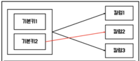

```table-of-contents
```

### 1. 정규화
#### 정규화란
- `정규화(Normalization)` : 
	- 정규화는 `논리 데이터 모델 상세화 과정의 대표적 활동` 
	- `논리 데이터 모델의 일관성을 확보하고 중복을 제거`하여 속성들이 가장 적절한 엔터티에 배치되도록 함으로써 보다 더 신뢰성 있는 데이터구조를 얻는 데 목적이 있음. (개념 데이터 모델의 일관성 확보 x)
- `정규형(NF; Normal Form)` : 정규화로 도출된 데이터 모델이 갖춰야 할 특성
	1) `제1정규형` : `모든 속성은 반드시 하나의 값(원자값)`을 가져야 함
	2) `제2정규형` : 엔터티의 `일반속성은 주식별자 전체에 종속`이어야 함
	3) `제3정규형` : 엔터티의 `일반속성 간에는 서로 종속적이지 않아야` 함
- 결정자 : 속성 A가 속성 B를 결정한다는 것은, A의 값이 B의 값을 유일하게 결정하는 경우를 말함
- `함수적 종속성(FD; Functional Dependency)` : 결정자와 종속자의 관계. 결정자의 값으로 종속자의 값을 알 수 있음

#### 정규화 이론
1) `1차 정규화` : 
	- `모든 속성이 하나의 값만` 가지도록 하는 것
	- 속성의 원자성 확보 및 다중값 속성을 분리
2) `2차 정규화` : 
	- `부분 함수 종속성` 제거
		
	- `일부 기본키에만 종속된 속성`을 분리
	- 기본키가 하나의 칼럼일 땐 생략 가능
3) `3차 정규화` : 
	- `이행 함수 종속성` 제거
		
	- `서로 종속관계가 있는 일반속성`을 분리
	- 주식별자와 관련성이 가장 낮음
4) `보이스코드 정규화(BCNF; Boyce-Codd Normal Form)` : 
	- 결정자가 후보키가 아닌 함수 종속 관계를 제거하여 `모든 결정자가 후보키가 되도록` 하는 것
	- ex) Student, Course, Professor가 속성으로 있는 테이블 가정 : 
		- (학생번호, 과목)이 기본키로 지도교수를 알 수 있는 테이블
		- 함수적 종속성 : "Student, Course -> Professor" (각 학생은 각 강좌에 대해 하나의 교수만 가질 수 있음), "Professor -> Course" (교수는 특정 강좌를 가르침)
		- 이 종속성에서 교수(Professor)는 결정자지만 후보 키가 아님. Professor는 테이블의 행을 고유하게 식별할 수 없기 때문
		- “Professor -> Course" 함수적 종속성이 BCNF를 위반
5) `4차 정규화` : 
	- `다치 종속` 제거
	- 다치 종속 : 
		- 같은 테이블 내의 독립적인 두 개 이상의 컬럼이 또 다른 컬럼에 종속되는 것
		- A → B 인 의존성에서 단일 값 A와 다중 값 B가 존재한다면 다치 종속
		- 이중 화살표(double arrow) ↠ 로 표기
		- 다치 종속은 최소 2개의 컬럼이 다른 컬럼에 종속되어야 하기 때문에 최소 3개의 컬럼이 필요
	- ex) Student, Course, Hobby가 속성으로 있는 테이블 가정 : 
		- 학생(Student)이 여러 강좌(Course)를 수강하고, 동시에 여러 취미(Hobby)를 가질 수 있음
		- Student -> Course와 Student -> Hobby 두가지 의존성을 가지므로 다치 종속
6) `5차 정규화` : 
	- `조인 종속` 제거
	- 조인 종속 : 하나의 릴레이션을 여러개의 릴레이션으로 분해하였다가, 다시 조인했을 때 데이터 손실이 없고 필요없는 데이터가 생기는 것
	- 5차 정규화는 조인에 의한 이상현상을 제거하여 정규화 수행

#### 정규화와 성능
- 정규화로 인한 성능 향상 : 
	- 데이터를 `입력/수정/삭제할 때는 일반적으로 처리 성능이 향상`됨
	- `중복 속성 제거`하여 용량 최소화 가능
	- 유연성 증가 : High Cohesion & Loose Coupling 원칙에 충실해짐
	- 재활용 가능성 증가 : 개념이 세분화됨
- 정규화로 인한 성능 저하 : 
	- 데이터 조회 시엔 처리 조건에 따라 `조회 성능 저하`가 발생할 수도 있음
	- 데이터 조회 시 조인을 유발하여 CPU와 메모리를 많이 사용하게 됨
	- 이 때문에 성능을 위해 데이터 중복을 허용하는 `반정규화` 고려하기도. 하지만 `반정규화만이 조회 성능을 항상 향상시키는 것은 아니며` 때로는 정규화에 의해 성능이 향상될 수도 있음

### 2. 관계와 조인의 이해
- `조인(Join)`이란 `식별자를 상속하고, 상속된 속성을 매핑키로 활용하여 데이터를 결합하는 것` 의미
- 부모의 식별자를 자식의 식별자에 포함하면 `식별관계`, 부모의 식별자를 자식의 일반속성으로 상속하면 `비식별관계`
- 관계(Relationship)를 맺는다는 것은 식별자를 상속시키고 해당 식별자를 매핑키로 활용해 데이터를 결합해 보겠다는 것 의미
- "SELECT B.고객명 FROM 주문 A, 고객 B WHERE A.고객번호 = B.고객번호" 쿼리에서 조인키(Join Key)는 "고객번호"

### 3. 모델이 표현하는 트랜잭션의 이해


### 4. Null 속성의 이해


### 5. 본질식별자 vs 인조식별자