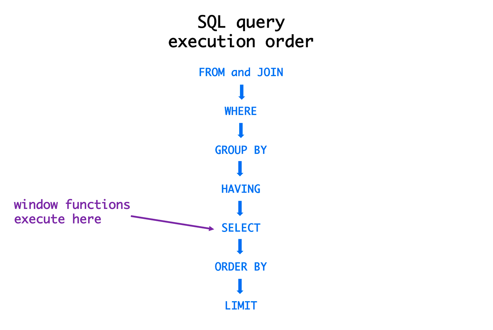

### 1. 관계형 데이터베이스 개요

#### DB란
- DB : 데이터를 일정한 형태로 저장해 놓은 것. DBMS를 이용하여 효율적인 데이터 관리와 데이터 손상 복구 가능
- 종류 : 
	- 계층형 DB : 트리 형태의 자료구조에 데이터 저장. 1:N 관계 표현
	- 네트워크형 DB : 오너와 멤버 형태로 데이터 저장. M:N 관계 표현
	- 관계형 DB : 릴레이션에 데이터 저장. 집합 연산과 관계 연산 가능

#### 관계형 DB
- 관계형 DB의 특징 :
	1) 정규화를 통해 이상현상 및 중복 데이터 제거 가능
	2) 동시성 관리와 병행 제어를 통해 데이터 동시 조작 가능
	3) 집합 연산과 관계 연산 가능
- 집합 연산 : 
	1) 합집합(Union)
	2) 차집합(Difference)
	3) 교집합(Intersection)
	4) 곱집합(Cartesian Product): 각 릴레이션에 존재하는 모든 데이터를 조합
- 관계 연산 : 
	- 선택 연산(Selection) : 조건에 맞는 행(튜플) 조회
	- 투영 연산(Projection): 조건에 맞는 칼럼(속성) 조회
	- 결합 연산(Join): 공통 속성을 사용하여 새로운 릴레이션 생성
	- 나누기 연산(Division): 공통요소를 추출하고 분모 릴레이션의 속성을 삭제한 후 중복된 행 제거

#### SQL
- SQL(Structured Query Language) : 관계형 DB에서 사용하는 언어. 데이터 조회 및 신규 데이터 입력/수정/삭제 기능 제공
- 종류로는 DML, DDL, DCL, TCL이 있음

#### SQL 실행순서
 

| SELECT 칼럼명 AS "별명"  | 5) 데이터 값을 출력/계산 (SELECT)          |
| ------------------- | --------------------------------- |
| FROM 테이블명           | 1) 발췌 대상 테이블을 참조 (FROM)           |
| WHERE 조건식           | 2) 발췌 대상 데이터가 아닌 것은 제거 (WHERE)    |
| GROUP BY 칼럼/표현식<br> | 3) 행들을 소그룹화 (GROUP BY)            |
| HAVING 조건식          | 4) 그루핑된 값의 조건에 맞는 것만을 출력 (HAVING) |
| ORDER BY 칼럼/표현식     | 6) 데이터를 정렬 (ORDER BY)             |
- FROM -> WHERE -> GROUP BY -> HAVING -> SELECT -> ORDER BY

#### SQL의 종류
| 명령어의 종류                                               | 명령어                                                     | 설명                                                                                                                      |
| ----------------------------------------------------- | ------------------------------------------------------- | ----------------------------------------------------------------------------------------------------------------------- |
| 데이터 조작어<br>(`DML` : Data<br>Manipulation<br>Language) | `SELECT`                                                | - 데이터베이스에 들어있는 데이터를 조회하거나 검색하기 위한 명령어를 말하는 것으로 RETRIEVE 라고도 함                                                           |
|                                                       | `INSERT`<br>`UPDATE`<br>`DELETE`                        | - 데이터베이스의 테이블에 들어있는 데이터에 변형을 가하는 종류의 명령어들을 말함<br>- 예를 들어 데이터를 테이블의 새로운 행에 집어넣거나, 원하지 않는 데이터를 삭제하거나 수정하는 명령어들을 DML이라고 부름 |
| 데이터 정의어<br>(`DDL` : Data<br>Definition<br>Language)   | `CREATE`<br>`ALTER`<br>`DROP`<br>`RENAME`<br>`TRUNCATE` | - 테이블과 같은 데이터 구조를 정의하는 데 사용되는 명령어들을 말함<br>- 그러한 구조를 생성/변경/삭제하거나 이름을 바꾸는 데이터 구조와 관련된 명령어들을 DDL이라고 함                      |
| 데이터 제어어<br>(DCL : Data<br>Control<br>Language)        | `GRANT`<br>`REVOKE`                                     | - 데이터베이스에 접근하고 객체들을 사용하도록 권한을 주고 회수하는 명령어를 DCL이라고 부름                                                                    |
| 트랜잭션 제어어(TCL :<br>Transaction<br>Control<br>Language) | `COMMIT`<br>`ROLLBACK`                                  | - 논리적인 작업의 단위를 묶어서 DML에 의해 조작된 결과를 작업단위(트랜잭션) 별로 제어하는 명령어를 말함                                                           |

### 2. WHERE 절
#### WHERE
```
SELECT 칼럼명 FROM 테이블명 WHERE 조건절;
```
- 데이터베이스에서 `조회되는 데이터에 대한 조건을 설정`하여 원하는 데이터만을 검색하기 위해 사용하는 절
- WHERE 절에는 `집계 함수를 사용할 수 없음` (집계 함수를 사용할 수 있는 GROUP BY 절보다 WHERE 절이 먼저 수행됨. WHERE 절은 전체 데이터를 GROUP으로 나누기 전에 행들을 미리 제거하는 역할)
- NULL 값을 조건절에서 사용하는 경우 `IS NULL`, `IS NOT NULL`이란 키워드 사용 (`NULL은 등호로 판단 불가 어떤 상황에서도`)
- WHERE 절에 사용되는 연산자는 3가지 종류 : `1) 비교 연산자(부정 비교 연산자 포함), 2) SQL 연산자(부정 SQL 연산자 포함), 3) 논리연산자`

#### 연산자
##### 비교 연산자
| `=`  | 같다        |
| ---- | --------- |
| `>`  | 보다 크다     |
| `>=` | 보다 크거나 같다 |
| `<`  | 보다 작다     |
| `<=` | 보다 작거나 같다 |

##### 부정 비교 연산자
| `!=`        | 같지 않다                           |
| ----------- | ------------------------------- |
| `^=`        | 같지 않다                           |
| `<>`        | 같지 않다 (ISO 표준. 모든 운영체제에서 사용 가능) |
| `NOT 칼럼명 =` | ~와 같지 않다                        |
| `NOT 칼럼명 >` | ~보다 크지 않다                       |

##### SQL 연산자
| `BETWEEN a AND b` | a와 b의 값 사이에 있으면 됨 (a와 b값이 포함됨)                                               |
| ----------------- | ---------------------------------------------------------------------------- |
| `IN (list)`       | 리스트에 있는 값 중에서 어느 하나라도 일치하면 됨                                                 |
| `LIKE '비교문자열'`    | 비교문자열과 형태가 일치하면 됨<br>(※ 와일드카드: `%(퍼센트)`는 `0개 이상의 문자`, `_(언더바)`는 `1개의 단일 문자`) |
| `IS NULL`         | NULL 값을 가짐                                                                   |

##### 부정 SQL 연산자
| `NOT BETWEEN a AND b` | a와 b의 값 사이에 있지 않음 (a, b 값을 포함하지 않음) |
| --------------------- | ----------------------------------- |
| `NOT IN (list)`       | list 값과 일치하지 않음                     |
| `IS NOT NULL`         | NULL 값을 갖지 않음                       |

##### 논리 연산자
| `AND` | 앞에 있는 조건과 뒤에 오는 조건이 참(TRUE)이 되어야 결과도 참(TRUE)이 됨. 즉, 앞의 조건과 뒤의 조건을 동시에 만족해야 함       |
| ----- | ---------------------------------------------------------------------------------- |
| `OR`  | 앞의 조건이 참(TRUE)이거나 뒤의 조건이 참(TRUE)이 되어야 겨로가도 참(TRUE)이 됨. 즉, 앞뒤의 조건 중 하나만 참(TRUE)이면 됨 |
| `NOT` | 뒤에 오는 조건에 반대되는 결과를 되돌려 줌                                                           |

##### 연산자의 우선순위
| 연산 우선순위 | 설명                  |
| ------- | ------------------- |
| 1       | 괄호 ()               |
| 2       | NOT 연산자             |
| 3       | 비교 연산자 및 SQL 비교 연산자 |
| 4       | AND                 |
| 5       | OR                  |
- 우선순위 : 부정 연산자 > 비교 연산자 > 논리 연산자
- 괄호로 묶은 연산이 제일 먼저 연산 처리됨
- 연산자들 중에서는 부정 연산자(NOT)가 먼저 처리되고, 비교 연산자(=, >, >=, <, <=), SQL 비교 연산자(BETWEEN a AND b, IN (list), LIKE, IS NULL)가 처리됨
- 다음으로 논리 연산자 중에서는 AND, OR의 순으로 처리됨

##### 문자열 비교 방법
- CHAR VS CHAR : 
	- 첫 서로 다른 문자열 값으로 비교 (뒤 순서가 더 큰 값)
	- 길이 다를 때 공백 추가하여 길이 맞춤 (공백 수만 다르면 같은 값)
- CHAR VS VARCHAR : 
	- 첫 서로 다른 문자열 값으로 비교
	- 길이가 다르면 길이가 긴 값이 크다고 판단
	- VARCHAR의 공백도 문자로 판단
	- TRIM 함수로 VARCHAR의 공백 제거하고 판단할 수 있음
- CHAR vs 상수 : 상수를 변수 타입으로 바꿔 비교

#### 부분 범위 처리
- `ROWNUM` (Oracle) : 
	- SQL 처리 결과 집합의 각 행에 임시로 부여되는 번호
	- 조건절 내에서 행의 개수를 제한하는 목적으로 사용
	- `SELECT PLAYER_NAME FROM PLAYER WHERE ROWNUM=1;`
- `TOP` (SQL Server) : 
	- 출력 행의 수 제한 함수
	- `TOP (N)`로 N개 행 출력
	- 개수 대신 비율로도 제한 가능
	- `SELECT TOP(1) PLAYER_NAME FROM PLAYER;`
- ORDER BY절이 없으면 ROWNUM과 TOP의 기능이 같음

### 3. 함수
#### 내장 함수 개요
- 함수는 벤더에서 제공하는 함수인 `내장 함수(Built-in Function)`와, `사용자가 정의할 수 있는 함수(User Defined Function)`로 나눌 수 있음
- 내장 함수는 다시 함수의 입력 값이 단일행 값이 입력되는 `단일행 함수`와, 여러 행의 값이 입력되는 `다중행 함수`로 나눌 수 있음
- 다중행 함수는 다시 `집계 함수(Aggregate Function)`, `그룹 합수(Group Function)`, `윈도우 함수(Window Function)`로 나눌 수 있음

#### 단일행 함수
##### 단일행 함수의 특징
- `1) SELECT절 2)WHERE절 3)ORDER BY절`에 사용 가능
- 각 행에 개별적으로 작용하여 데이터 값들을 조작하고, 각각의 행에 대한 조작 결과를 리턴함
- 여러 인자를 입력해도 단 하나의 결과만 리턴함
- 함수의 인자로 상수, 변수, 표현식이 사용 가능
- 특별한 경우가 아니면 함수의 인자로 함수를 사용하는 함수의 중첩이 가능

##### 단일행 함수의 종류
| 종류           | 내용                       | 함수의 예                                                                                               |
| ------------ | ------------------------ | --------------------------------------------------------------------------------------------------- |
| `문자형 함수`     | 문자를 입력하면 문자나 숫자 값을 반환    | LOWER, UPPER, SUBSTR/SUBSTRING, LENGTH/LEN, LTRIM, RTRIM, TRIM, ASCII, REPLACE                      |
| `숫자형 함수`     | 숫자를 입력하면 숫자 값을 반환        | ABS, MOD, ROUND, TRUNC, SIGN, CHR/CHAR, CEIL/CEILING, FLOOR, EXP, LOG, LN, POWER, SIN, COS, TAN     |
| `날짜형 함수`     | DATE 타입의 값을 연산           | SYSDATE/GETDATE, EXTRACT/DATEPART, TO_NUMBER(TO_CHAR(d, 'YYYY'\|'MM'\|'DD')) / YEAR \| MONTH \| DAY |
| `변환형 함수`     | 문자, 숫자 날짜형 값의 데이터 타입을 변환 | TO_NUMBER, TO_CHAR, TO_DATE / CAST, CONVERT                                                         |
| `NULL 관련 함수` | NULL을 처리하기 위한 함수         | NVL/ISNULL, NULLIF, COALESCE                                                                        |
* * 주: Oracle함수/SQL Server함수 표시. '/' 없는 것은 공통 함수

##### 문자형 함수
| 문자형 함수 종류                                         | 함수 설명                                                                                                                                           |
| ------------------------------------------------- | ----------------------------------------------------------------------------------------------------------------------------------------------- |
| `LOWER(문자열)`                                      | 문자열의 알파벳 문자를 소문자로 바꾸어 줌                                                                                                                         |
| `UPPER(문자열)`                                      | 문자열의 알파벳 문자를 대문자로 바꾸어 줌                                                                                                                         |
| `ASCII(문자)`                                       | 문자나 숫자를 ASCII 코드 번호로 바꾸어 줌                                                                                                                      |
| `CHR/CHAR(ASCII번호)`                               | ASCII 코드 번호를 문자나 숫자로 바꾸어 줌                                                                                                                      |
| `CONCAT(문자열1, 문자열2)`                              | Oracle, My SQL에서 유효한 함수이며 문자열1과 문자열2를 연결함. 합성 연산자 `\|\|`(Oracle)나 `+`(SQL Server)와 동일함                                                          |
| `SUBSTR/SUBSTRING(문자열, m[, n])`                   | - 문자열 중 m번째 위치에서 n개의 문자 길이에 해당하는 문자를 돌려줌 (n이 생략되면 마지막 문자까지 돌려줌)<br>- `m은 0번째부터가 아닌 1번째부터 시작`                                                    |
| `LENGTH/LEN(문자열)`                                 | 문자열의 개수를 숫자값으로 돌려줌                                                                                                                              |
| `LTRIM(문자열 [, 지정문자])`                             | - 문자열의 첫 문자부터 확인해서 지정 문자가 나타나면 해당 문자를 제거 (지정 문자 생략되면 공백 값이 디폴트)<br>- SQL Server에서는 LTRIM 함수에 지정문자를 사용할 수 없음. 즉, 공백만 제거 가능                       |
| `RTRIM(문자열 [, 지정문자])`                             | - 문자열의 마지막 문자부터 확인해서 지정 문자가 나타나는 동안 해당 문자를 제거 (지정 문자 생략되면 공백 값이 디폴트)<br>- SQL Server에서는 RTRIM 함수에 지정문자를 사용할 수 없음. 즉, 공백만 제거 가능                  |
| TRIM([leading \| trailing \| both] 지정문자 FROM 문자열) | - 문자열에서 머리말, 꼬리말, 또는 양쪽에 있는 지정 문자를 제거함. (leading \| trailing \| both 가 생략되면 both가 디폴트)<br>- SQL Server에서는 TRIM 함수에 지정문자를 사용할 수 없음. 즉, 공백만 제거 가능 |
| `REPLACE(칼럼명 or 문자열, 찾을문자, 치환문자)`                 | - 특정 문자열을 찾아 바꾸는 함수<br>- REPLACE 함수를 사용하여 특정 문자를 제거할 때는 "치환문자" 항목은 생략하고 "찾을문자"까지만 입력                                                            |
* * 주: Oracle함수/SQL Server함수 표시. '/' 없는 것은 공통 함수

| 문자형 함수 예시                                                                            | 결과값                                  |
| ------------------------------------------------------------------------------------ | ------------------------------------ |
| LOWER('SQL Expert')                                                                  | 'sql expert'                         |
| UPPER('SQL Expert')                                                                  | 'SQL EXPERT'                         |
| ASCII('A')                                                                           | 65                                   |
| CHR(65) / CHAR(65)                                                                   | 'A'                                  |
| CONCAT('RDBMS', ' SQL')<br>'RDBMS' \|\| ' SQL' /<br>'RDBMS' + ' SQL'                 | 'RDBMS SQL'                          |
| `SUBSTR('SQL Expert', 5, 3)` /<br>`SUBSTRING('SQL Expert', 5, 3)`                    | `'Exp'`                              |
| LENGTH('SQL Expert') /<br>LEN('SQL Expert')                                          | 10                                   |
| LTRIM('xxxYYZZxYZ', 'x')<br>RTRIM('XXYYzzXYzz', 'z')<br>TRIM('x' FROM 'xxYYZZxYZxx') | 'YYZZxYZ'<br>'XXYYzzXY'<br>'YYZZxYZ' |
| RTRIM('XXYYZZXYZ     ')<br>-> 공백 제거 및 CHAR와 VARCHAR 데이터 유형을 비교할 때 용이하게 사용됨           | 'XXYYZZXYZ'                          |

##### 숫자형 함수
| 숫자형 함수 종류                             | 함수 설명                                                                            |
| ------------------------------------- | -------------------------------------------------------------------------------- |
| `ABS(숫자)`                             | 숫자의 절대값을 돌려줌                                                                     |
| `SIGN(숫자)`                            | 숫자가 양수인지, 음수인지, 0인지를 구별함                                                         |
| `MOD(숫자1, 숫자2)`                       | - 숫자1을 숫자2로 나누어 나머지 값을 리턴<br>- MOD 함수는 % 연산자로도 대체 가능(ex. 7%3)                    |
| `CEIL/CEILING(숫자)`                    | 숫자보다 크거나 같은 최소 정수를 리턴                                                            |
| `FLOOR(숫자)`                           | 숫자보다 작거나 같은 최대 정수를 리턴                                                            |
| `ROUND(숫자 [, m])`                     | - 숫자를 소수점 m자리에서 `반올림`하여 리턴<br>- `소수점 0자리부터 시작`<br>- m이 생략되면 디폴트 값은 0             |
| `TRUNC(숫자 [, m])`                     | - 숫자를 소수점 m자리에서 잘라서 버림<br>- m이 생략되면 디폴트 값은 0<br>- SQL Server에서는 TRUNC 함수 제공되지 않음 |
| `SIN, COS, TAN, ...`                  | 숫자의 삼각함수 값을 리턴                                                                   |
| `EXP(), POWER(), SQRT(), LOG(), LN()` | 숫자의 지수, 거듭제곱, 제곱근, 자연 로그 값을 리턴                                                   |
- * 주: Oracle함수/SQL Server함수 표시. '/' 없는 것은 공통 함수

| 숫자형 함수 예시                                                                     | 결과값                                        |
| ----------------------------------------------------------------------------- | ------------------------------------------ |
| ABS(-15)                                                                      | 15                                         |
| SIGN(-20)<br>SIGN(0)<br>SIGN(+20)<br>                                         | -1<br>0<br>1                               |
| MOD(7, 3) /<br>7%3                                                            | 1                                          |
| CEIL(38.123) /<br>CEILING(38.123)<br>CEILING(-38.123)                         | 39<br>39<br>-38                            |
| FLOOR(38.123)<br>FLOOR(-38.123)                                               | 38<br>-39                                  |
| ROUND(38.5235, 3)<br>ROUND(38.5235, 1)<br>ROUND(38.5235, 0)<br>ROUND(38.5235) | 38.524<br>38.5<br>39<br>39 (인수 0이 Default) |
| TRUNC(38.5235, 3)<br>TRUNC(38.5235, 1)<br>TRUNC(38.5235, 0)<br>TRUNC(38.5235) | 38.523<br>38.5<br>38<br>38 (인수 0이 Default) |

##### 날짜형 함수
| 날짜형 함수 종류                                                                                                                            | 함수 설명                                                                                                          |
| ------------------------------------------------------------------------------------------------------------------------------------ | -------------------------------------------------------------------------------------------------------------- |
| SYSDATE /<br>GETDATE()                                                                                                               | 현재 날짜와 시각을 출력함                                                                                                 |
| EXTRACT('YEAR' \| 'MONTH' \| 'DAY' from d) /<br>DATEPART('YEAR' \| 'MONTH' \| 'DAY', d)                                              | - 날짜 데이터에서 년/월/일 데이터를 출력할 수 있음<br>- 시간/분/초도 가능                                                                 |
| TO_NUMBER(TO_CHAR(d, 'YYYY')) /<br>YEAR(d),<br>TO_NUMBER(TO_CHAR(d, 'MM')) /<br>MONTH(d),<br>TO_NUMBER(TO_CHAR(d, 'DD')) /<br>DAY(d) | - 날짜 데이터에서 년/월/일 데이터를 출력할 수 있음<br>- SQL Server DEPART YEAR/MONTH/DAY 옵션과 같은 기능<br>- TO_NUMBER 함수 제외시 문자형으로 출력됨 |
| NEXT_DAY('기준일자', '찾을요일')                                                                                                             | 기준일자를 제외하고 이후 날짜 중 조건에 주어진 요일에 해당하는 날짜를 반환                                                                     |
- * 주: Oracle함수/SQL Server함수 표시. '/' 없는 것은 공통 함수

- 예시 : 
	```
	SELECT SYSDATE 
	    , NEXT_DAY(SYSDATE-8,'SUN') prev_sunday //이전 일요일
	    , NEXT_DAY(SYSDATE,'SUN') next_sunday //다음 일요일 
	FROM DUAL
	```

###### 단일행 날짜형 데이터 연산
- `오라클`에서는 `숫자 연산처럼 +, - 사용하여 날짜 연산 가능`
	```
	SELECT
		TO_CHAR(SYSDATE ,'yyyy/mm/dd'), //오늘 날짜
		TO_CHAR(SYSDATE + 1 ,'yyyy/mm/dd'), //내일 날짜
		TO_CHAR(SYSDATE - 1 ,'yyyy/mm/dd'), //어제 날짜
		TO_CHAR(SYSDATE + 1/24/60/60 ,'yyyy/mm/dd hh24:mi:ss'), //1초 뒤 시간
		TO_CHAR(SYSDATE + 1/24/60 ,'yyyy/mm/dd hh24:mi:ss'), //1분 뒤 시간
		TO_CHAR(SYSDATE + 1/24 ,'yyyy/mm/dd hh24:mi:ss'), //1시간 뒤 시간
		TO_DATE(TO_CHAR(SYSDATE, 'YYYYMMDD')) - TO_DATE('19930315'), //두 날짜 사이 일수 계산
	FROM DUAL;

| 연산         | 결과  | 설명                            |
| ---------- | --- | ----------------------------- |
| 날짜 + 숫자    | 날짜  | 숫자만큼의 날수를 날짜에 더함<br>          |
| 날짜 - 숫자    | 날짜  | 숫자만큼의 날수를 날짜에서 뺌              |
| 날짜1 - 날짜2  | 날짜수 | 다른 하나의 날짜에서 하나의 날짜를 빼면 일수가 나옴 |
| 날짜 + 숫자/24 | 날짜  | 시간을 날짜에 더함                    |

###### DUAL 테이블의 특성
- 사용자 SYS가 소유하며 모든 사용자가 액세스 가능한 테이블
- SELECT ~ FROM ~ 의 형식을 갖추기 위한 일종의 DUMMY 테이블
- DUMMY 라는 문자열 유형의 칼럼에 'X'라는 값이 들어있는 행을 1건 포함하고 있음

##### 변환형 함수
- 데이터 유형 변환의 종류 : 
	- 명시적(Explicit) 데이터 유형 변환 : 데이터 변환형 함수로 데이터 유형을 변환하도록 명시해 주는 경우. 변환형 함수 사용 시 명시적 데이터 변환.
	- 암시적(Implicit) 데이터 유형 변환 : 데이터베이스가 자동으로 데이터 유형을 변환하여 계산하는 경우

| 변환형 함수 종류 - Oracle           | 함수 설명                              |
| ---------------------------- | ---------------------------------- |
| TO_NUMBER(문자열)               | alphanumeric 문자열을 숫자로 변환           |
| TO_CHAR(숫자 \| 날짜 [, FORMAT]) | 숫자나 날짜를 주어진 FORMAT 형태로 문자열 타입으로 변환 |
| TO_DATE(문자열 [, FORMAT])      | 문자열을 주어진 FORMAT 형태로 날짜 타입으로 변화     |

| 변환형 함수 종류 - SQL Server                               | 함수 설명                      |
| ---------------------------------------------------- | -------------------------- |
| CAST (expression AS data_type [(length)])            | expression을 목표 데이터 유형으로 변환 |
| CONVERT (data_type [(length)], expression [, style]) | expression을 목표 데이터 유형으로 변환 |

##### CASE 표현
- CASE 표현은 IF-THEN-ELSE 논리와 유사한 방식으로 표현식 작성해서 SQL의 비교 연산 기능을 보완하는 역할을 함
- ANSI/ISO SQL 표준에는 CASE Expression 이라고 표시되어 있는데, 함수와 같은 성격을 가지고 있으며 Oracle의 Decode 함수와 같은 기능을 하므로 단일행 내장 함수에서 같이 설명함

| CASE 표현의 종류                                                           | 함수 설명                                                                                                                                                                                                                                                                                                                                                                                                                                                                                                                                                |
| --------------------------------------------------------------------- | ---------------------------------------------------------------------------------------------------------------------------------------------------------------------------------------------------------------------------------------------------------------------------------------------------------------------------------------------------------------------------------------------------------------------------------------------------------------------------------------------------------------------------------------------------- |
| (단순 CASE 함수)<br><br>`CASE WHEN 조건절1 THEN 출력값1 ... ELSE 기본값 END`       | - 결과가 TRUE 인 조건절을 만나게 되면 해당하는 THEN 절의 출력값을 리턴하고, 조건이 맞지 않으면 ELSE 절의 기본값 리턴<br>- `ELSE 부분은 생략이 가능`하며, `만족하는 조건 없으면 NULL 리턴`함<br>- 'CASE WHEN NULL THEN 출력값 ELSE 기본값'은 조건이 없으므로 모든 행에서 기본값 출력 (일반적으로 'WH                                                                                                                                                                                                                                                                                                                        EN 칼럼 IS NULL'로 수정 필요) |
| (검색 CASE 함수)<br><br>`CASE 칼럼이름 WHEN 값1 THEN 출력값1 ... ELSE 기본값 END`    | - = 조건만 있는 경우 검색 CASE 표현식을 단순 CASE 표현식으로 변환 가능<br>- CASE 바로 뒤에 칼럼명을 쓰고 WHEN 절의 값이 그 칼럼의 값과 일치하는 THEN 절의 출력값 리턴                                                                                                                                                                                                                                                                                                                                                                                                                                       |
| (DECODE 함수)<br><br>`DECODE(표현식, 기준값1, 출력값1 [, 기준값2, 출력값2, ...], 기본값)` | - Oracle에서만 사용되는 함수<br>- 표현식의 값이 기준값1이면 출력값1을 출력하고, 기준값2이면 출력값2를 출력.<br>- 기준값이 없으면 기본값을 출력                                                                                                                                                                                                                                                                                                                                                                                                                                                           |

```
	// 검색 CASE 함수
	CASE 
	  WHEN 조건1 THEN 값
	  WHEN 조건2 THEN 값 
	  WHEN 조건3 THEN 값 
	  ELSE 값
	END
	
	// 예시
	SELECT email,
	CASE
		WHEN age >= 20 AND age < 30 THEN '이십 대'
	    WHEN age BETWEEN 30 AND 39 THEN '삼십 대'
	    ELSE "기타"
	END as "나이 대"
	FROM main_database.member;

	-------------------------------------------------
	
	// 단순 CASE 함수
	CASE 컬럼 이름
		WHEN 값 THEN 값
	    WHEN 값 THEN 값
	    WHEN 값 THEN 값
	    ELSE 값
	END
	
	// 예시
	SELECT email,
	CASE age 
		WHEN 22 THEN '스물 두 살'
	    WHEN 32 THEN '서른 두 살'
	    ELSE age
	END as "나이"
	FROM main_database.member;
```

##### NULL 관련 함수
| NULL 관련 함수 종류                           | 함수 설명                                                                                                                                                                                        |
| --------------------------------------- | -------------------------------------------------------------------------------------------------------------------------------------------------------------------------------------------- |
| NVL(표현식1, 표현식2) /<br>ISNULL(표현식1, 표현식2) | - 표현식1 결과값이 NULL이면 표현식2의 값 출력. 아니면 표현식1 값 출력<br>- 단, 표현식2과 표현식2의 결과 데이터 타입이 같아야 함<br>- NULL 관련 가장 많이 사용되는 함수<br>- NVL2(표현식1, 표현식2, 표현식3) : 표현식1 결과값이 NULL이면 표현식2의 값 출력, NULL이 아니면 표현식3의 값 출력 |
| `NULLIF(표현식1, 표현식2)`                    | - 표현식1이 표현식2와 `같으면 NULL`을, `같지 않으면 표현식1`을 리턴                                                                                                                                                 |
| COALESCE(표현식1, 표현식, ...)                | - 임의의 개수 표현식에서 NULL이 아닌 최초의 표현식을 나타냄<br>- 모든 표현식이 NULL이라면 NULL을 리턴함                                                                                                                          |
- * 주: Oracle함수/SQL Server함수 표시. '/' 없는 것은 공통 함수

- 예시 : 
	```
	// 사원 테이블에서 MGR과 7698이 같으면 NULL을 표시하고,
	// 같지 않으면 MGR을 표시
	SELECT ENAME, EMPNO, MGR, NULLIF(MGR, 7698) NUIF FROM EMP;
	
	// 사원 테이블에서 커미션을 1차 선택값으로,
	// 급여를 2차 선택값으로 선택하되,
	// 두 칼럼 모두 NULL인 경우는 NULL로 표시
	SELECT ENAME, COMM, SAL, COALESCE(COMM, SAL) COAL FROM EMP;
	```

### 4. GROUP BY, HAVING 절
#### 집계 함수(Aggregate Function)
- 그룹별 결과 출력. `다중행 함수` 중 하나
- `GROUP BY 절이 없으면 그룹핑 대상이 존재하지 않아 에러 발생`
- `WHERE 절에 사용 불가` (집계 함수를 사용할 수 있는 GROUP BY 절보다 WHERE 절이 먼저 수행됨. WHERE 절은 전체 데이터를 GROUP으로 나누기 전에 행들을 미리 제거하는 역할)
- 공집합에서도 연산 수행
- ALL, DISTINCT : 전체 출력, 중복 제외 출력
- `집계 함수의 통계 정보(SUM, AVG, MAX, MIN, VARIAN, STDDEV)`는 `NULL 값을 가진 행을 제외하고 수행` (<-> 숫자 연산은 NULL 출력)
- 단, `SUM으로 더하는 모든 값이 NULL만 있을 경우엔 0이 아닌 NULL이 결과로 나옴`
- COUNT : 행 수 출력
	- `COUNT(*)` : `NULL 포함`
	- `COUNT(표현식)` : `NULL 제외`

| 집계 함수 종류                      | 사용 목적                                  |
| ----------------------------- | -------------------------------------- |
| COUNT(*)                      | NULL 값을 포함한 행의 수를 출력                   |
| COUNT(표현식)                    | 표현식의 값이 NULL 값인 것을 제외한 행의 수를 출력        |
| SUM([DISTINCT \| ALL] 표현식)    | 표현식의 NULL 값을 제외한 합계를 출력                |
| AVG([DISTINCT \| ALL] 표현식)    | 표현식의 NULL 값을 제외한 평균을 출력                |
| MAX([DISTINCT \| ALL] 표현식)    | 표현식의 최대값을 출력<br>(문자, 날짜 데이터 타입도 사용 가능) |
| MIN([DISTINCT \| ALL] 표현식)    | 표현식의 최소값을 출력<br>(문자, 날짜 데이터 타입도 사용 가능) |
| STDDEV([DISTINCT \| ALL] 표현식) | 표현식의 표준 편차를 출력                         |
| VARIAN([DISTINCT \| ALL] 표현식) | 표현식의 분산을 출력                            |
| 기타 통계 함수                      | 벤더별로 다양한 통계식을 제공함                      |

#### GROUP BY
```
SELECT 
	칼럼명 [ALIAS명]
FROM 테이블명
[WHERE 조건식]
[GROUP BY 칼럼이나 표현식]
[HAVING 그룹조건식];
```
- `GROUP BY 절을 통해 소그룹별 기준을 정한 후, SELECT 절에 집계 함수`를 사용함
- SELECT 절과는 달리 `ALIAS 명을 사용할 수 없음`
- `GROUP BY 절은 NULL 데이터도 집계에 포함`하기 때문에 NULL이 있는 행도 결과로 출력됨

#### HAVING
- GROUP BY 절에 의한 집계 데이터에 출력 조건을 걺 (<-> WHERE 절에서 제외된 데이터는 GROUP BY 대상이 아님)
- 일반적으로 GROUP BY 절 뒤에 위치
- GROUP BY 절의 기준 항목이나 소그룹의 집계 함수를 이용한 조건을 표시할 수 있음
- GROUP BY 절에 의한 소그룹별로 만들어진 집계 데이터 중 HAVING 절에서 제한 조건을 두어 조건을 만족하는 내용만 출력함

### 5. ORDER BY 절
#### ORDER BY
```
SELECT 
	칼럼명 [ALIAS명]
FROM 테이블명
[WHERE 조건식]
[GROUP BY 칼럼이나 표현식]
[HAVING 그룹조건식]
[ORDER BY 칼럼이나 표현식 [ASC(오름차순) 또는 DESC(내림차순)]];
```
- 특정 칼럼을 기준으로 정렬. 기본 정렬기준은 오름차순(ASC)
	- 숫자형 데이터 타입은 오름차순 정렬했을 경우 가장 작은 값부터 출력
	- 날짜형 데이터 타입은 오름차순 정렬했을 경우 날짜 값이 가장 이른 값이 먼저 출력  
	- Oracle은 NULL값을 최대값으로 간주하여, 오름차순 정렬했을 경우엔 가장 마지막에, 내림차순 정렬했을 경우엔 가장 먼저 위치함
	- SQL Server에서는 NULL값을 최소값으로 간주하여, 오름차순 정렬했을 경우엔 가장 먼저, 내림차순 정렬했을 경우엔 가잔 마지막에 위치함
- `1) 칼럼명 2) 앨리어스 3) 칼럼의 SELECT절에서의 순서(숫자)`로 칼럼 지정 가능
	- 칼럼의 SELECT절에서의 순서(숫자)로 정렬하는 예시 : 
		```
		SELECT empno 
			, ename 
			, job 
			, sal 
		FROM emp 
		WHERE deptno = 30 
		ORDER BY 4, 3 DESC
		
		// 여기서 4는 sal, 3은 job
		```
- `SELECT 절에 기술되지 않은 컬럼`도 `FROM 절의 테이블에 포함`되어 있다면 `ORDER BY 절에 사용 가능`
	- 행기반 DATABASE(ex.SQL Server, Oracle)의 경우 데이터를 액세스할 때 행 전체 칼럼을 메모리에 로드하기 때문
	- 단, 아래와 같은 경우엔 IN-LINE VIEW가 먼저 수행됨에 따라 . 더이상 SELECT절 외 칼럼을 사용할 수 없기 때문에 정렬 불가능
		```
		SELECT 지역, 매출금액
		FROM (
			SELECT 지역, 매출금액
			FROM 지역별매출
		)
		ORDER BY 년 ASC;
		```
- GROUP BY 절 사용할 경우, ORDER BY 절에 집계함수(COUNT, SUM, MAX, ...) 사용 가능
- `GROUP BY 절 사용`할 경우, `SELECT 절에 없는 칼럼 사용하여 정렬 시 오류 발생`

### 6. 조인
- 두 개 이상의 테이블들을 연결 또는 결합하여 데이터를 출력하는 것
- 일반적으로 조인은 `PK와 FK값의 연관성에 의해 성립` (어떤 경우에는 PK FK 관계 없이 논리적인 값들의 연관만으로 조인이 성립되기도 함)
- `DBMS 옵티마이저`는 FROM 절에 나열된 테이블이 아무리 많아도 `항상 2개의 테이블씩 짝을 지어 JOIN을 수행`함
- 전체 테이블 개수에서 `최소 N-1개` 만큼의 JOIN 조건이 필요함
	- ex) 5개의 테이블로부터 필요한 칼럼을 조회하려고 할 때, 최소 몇개의 JOIN 조건이 필요? -> 4개

#### 등가 조인(EQUI JOIN)
- 조인에 관여하는 테이블 간의 `칼럼 값들이 정확하게 일치`하는 경우에 사용되는 방법
- `EQUI JOIN은 '=' 연산자에 의해서만 수행`되며, `그 이외의 비교 연산자를 사용하는 경우는 모두 NON EQUI JOIN`
- EQUI JOIN 문장 : 
	```
	SELECT 테이블1.칼럼명, 테이블2.칼럼명, ...
	FROM 테이블1, 테이블2
	WHERE 테이블1.칼럼명1 = 테이블2.칼럼명2;
	
	-> WHERE 절에 JOIN 조건을 넣음
	```
- ANSI/ISO SQL 표준 EQUI JOIN 문장 :
	```
	SELECT 테이블1.칼럼명, 테이블2.칼럼명, ...
	FROM 테이블1 INNER JOIN 테이블2
	ON 테이블1.칼럼명1 = 테이블2.칼럼명2;
	
	-> ON 절에 JOIN 조건을 넣음
	```

#### 비등가 조인(NON EQUI JOIN)
- 두 테이블의 칼럼 값이 정확하게 일치하지 않는 경우
- '=' 연산자를 제외한 비교 연산자(부등호나 BETWEEN 연산자)를 통해 조인
- 대부분 NON EQUI JOIN을 수행할 수 있지만, 때로는 설계상의 이유로 수행이 불가능한 경우도 있음 

### 7. 표준 조인
#### 일반 집합 연산자 / 순수 관계 연산자
- 현재 사용하는 SQL의 많은 기능이 관계형 데이터베이스 이론을 수립한 E.F.Codd 박사의 논문에 언급 되어있음
- 논문에 언급된 8가지 관계형 대수는 각각 4개의 `일반 집합 연산자`와 `순수 관계 연산자`로 나눌 수 있으며, 관계형 데이터베이스 엔진 및 SQL의 기반 이론이 됨

- `일반 집합 연산자`를 현재의 SQL과 비교하면,
	- 1) `UNION 연산`은 `UNION 기능`으로 구현
	- 2) `INTERSETION 연산`은 `INTERSECT 기능`으로 구현
	- 3) `DIFFERENCE 연산`은 `EXCEPT(Oracle은 MINUS) 기능`으로 구현
	- 4) `PRODUCT 연산`은 `CROSS JOIN 기능`으로 구현


| 일반 집합 연산자      | SQL에서 구현된 결과                           | 설명  |
| -------------- | -------------------------------------- | --- |
| `UNION`        | `UNION`                                | 합집합 |
| `INTERSECTION` | `INTERSECT`                            | 교집합 |
| `DIFFERENCE`   | `MINUS (오라클)`<br>`EXCEPT (SQL Server)` | 차집합 |
| `PRODUCT`      | `CROSS JOIN`                           | 곱집합 |

- `순수 관계 연산자`를 현재의 SQL과 비교하면,
	- 1) `SELECT 연산`은 `WHERE 절`로 구현 (SELECT 연산과 SELECT 절의 의미 다름 주의)
	- 2) `PROJECT 연산`은 `SELECT 절`로 구현
	- 3) `(NATURAL) JOIN 연산`은 `다양한 JOIN 기능`으로 구현
	- 4) `DIVIDE 연산`은 현재 사용되지 않음


| 순수 관계 연산자 | SQL에서 구현된 결과 | 설명                                                                                                                 |
| --------- | ------------ | ------------------------------------------------------------------------------------------------------------------ |
| `SELECT`  | `WHERE 절`    | SELECT 연산은 SQL 문장에서는 WHERE 절의 조건절 기능으로 구현                                                                          |
| `PROJECT` | `SELECT 절`   | PROJECT 연산은 SQL 문장에서는 SELECT 절의 칼럼 선택 기능으로 구현                                                                      |
| `JOIN`    | `다양한 JOIN`   | JOIN 연산은 WHERE 절의 INNER JOIN 조건과 함께 FROM 절의 NATURAL JOIN, INNER JOIN, OUTER JOIN, USING 조건절, ON 조건절 등으로 가장 다양하게 발전 |
| `DIVIDE`  | 없음           | DIVIDE 연산은 나눗셈과 비슷한 개념으로, 왼쪽의 집합을 'XZ'로 나누었을 때 'XZ'를 모두 갖고 있는 'A'가 답이 되는 기능. 현재 사용하지 않음                            |

#### FROM 절 JOIN 형태
- ANSI/ISO SQL에서 표시하는 FROM 절의 JOIN 형태는 다음과 같음 : 
	- INNER JOIN
	- NATURAL JOIN
	- USING 조건절
	- ON 조건절
	- CROSS JOIN
	- OUTER JOIN(LEFT, RIGHT, FULL)

#### INNER JOIN
- OUTER(외부) JOIN과 대비하여 내부 JOIN이라고 하며, `JOIN 조건에서 동일한 값이 있는 행만 반환`
- INNER JOIN 표시는 그 동안 WHERE 절에서 사용하던 JOIN 조건을 FROM 절에서 정의하겠다는 표시이므로 USING 조건절이나 ON 조건절을 필수적으로 사용해야 함
- 예시 : 
```
	SELECT EMP.DEPTNO, EMPNO, ENAME, DNAME 
	FROM EMP INNER JOIN DEPT 
	ON EMP.DEPTNO = DEPT.DEPTNO; 
		
	-- INNER 는 JOIN의 디폴트 옵션이라서 생략할 수 있다. 
	SELECT EMP.DEPTNO, EMPNO, ENAME, DNAME 
	FROM EMP JOIN DEPT 
	ON EMP.DEPTNO = DEPT.DEPTNO;
```

#### NATURAL JOIN
- 두 테이블 간의 `동일한 이름을 갖는 모든 칼럼들에 대해 EQUI(=) JOIN을 수행`
- NATURAL JOIN이 명시되면, `추가로 USING 조건절, ON 조건절, WHERE 절에서 JOIN 조건을 정의할 수 없음`
- `SQL Server에서는 지원하지 않음`
- NATURAL JOIN에 사용된 칼럼들은 `같은 데이터 유형`이어야 하며, `ALIAS나 테이블 명과 같은 접두사를 붙일 수 없음`
- INNER JOIN과의 차이점 : 
	- `'*'` 와일드카드처럼 별도의 칼럼 순서를 지정하지 않으면  `NATURAL JOIN의 기준이 되는 칼럼들이 다른 칼럼보다 먼저 출력` (<-> INNER JOIN의 경우 `첫번째 테이블, 두번째 테이블의 칼럼 순서대로 데이터 출력`)
	- NATURAL JOIN은 JOIN에 사용된 `같은 이름의 칼럼을 하나로 처리` (<-> INNER JOIN은 `별개의 칼럼으로 표시`)
- 예시 : 
	```
	SELECT DEPTNO, EMPNO, ENAME, DNAME FROM EMP NATURAL JOIN DEPT ;
	```
	- 별도의 JOIN 컬럼을 지정하지 않아도 두 개 테이블에서 DEPTNO라는 공통된 컬럼을 자동으로 인식하여 조인 처리
	- 모델링 상의 부주의로 동일한 컬럼명인데 다른 용도로 사용되는 경우도 있으므로 NATURAL JOIN 사용 시 주의해야 함

#### USING 조건절
- FROM절의 USING 조건절을 이용하면 `같은 이름을 가진 컬럼들 중에서 원하는 컬럼에 대해서만 선택적으로 EQUI JOIN` 할 수 있음
- `sql server에서는 지원하지 않음`
- `'*'` 와일드카드처럼 별도의 칼럼 순서를 지정하지 않으면  `USING 조건절의 기준이 되는 칼럼들이 다른 칼럼보다 먼저 출력`
- USING JOIN은 `JOIN에 사용된 같은 이름의 칼럼을 하나로 처리`
- USING 조건절을 이용한 EQUI JOIN에서도 NATURAL JOIN과 마찬가지로 JOIN 칼럼에 대해서는 `ALIAS나 테이블 명과 같은 접두사를 붙일 수 없음`
- 예시 : 
	```
	SELECT * 
	FROM DEPT [INNER] JOIN DEPT_TEMP 
	USING (DEPTNO) ;

	// USING 절의 열 부분은 식별자를 가질 수 없음
	SELECT DEPTNO, DEPT.DNAME -- DEPT.DEPTNO 일 경우 에러
	FROM DEPT JOIN DEP_TEMP
	USING (DEPTNO);

	SELECT * FROM DEPT JOIN DEPT_TEMP USING (DEPTNO, DNAME);
	-- USING에 사용된 DEPTNO, DNAME이 첫 번째, 두 번째 칼럼으로 출력
	-- JOIN 조건에 참여하지 않은 LOC은 2개의 칼럼으로 표시
	```

#### ON 조건절
- JOIN 서술부(ON 조건절)와 비 JOIN 서술부(WHERE 조건절)를 분리하여 이해가 쉬우며, `칼럼명이 다르더라도 JOIN 조건을 사용할 수 있음`
```
	SELECT E.EMPNO, E.ENAME, E.DEPTNO, D.DNAME 
	FROM EMP E JOIN DEPT D
	ON (E.DEPTNO = D.DEPTNO) ; -- 괄호는 없어도 됨. (옵셔널)
```
- WHERE 절과 혼용해서 사용도 가능
```
	SELECT E.EMPNO, E.ENAME, E.DEPTNO, D.DNAME
	FROM EMP E JOIN DEPT D
	ON (E.DEPTNO = D.DEPTNO)
	WHERE E.DEPTNO = 30 ;
```
- ON 조건절에 검색 조건을 사용할 수 있지만 (WHERE 기능과 같음), WHERE를 쓰는 것을 권장
```
	SELECT E.EMPNO, E.ENAME, E.DEPTNO, D.DNAME
	FROM EMP E JOIN DEPT D
	ON (E.DEPTNO = D.DEPTNO
	AND E.MGR = 7777) ;

	// 위는 아래와 같은 결과
	SELECT E.EMPNO, E.ENAME, E.DEPTNO, D.DNAME
	FROM EMP E JOIN DEPT D
	ON (E.DEPTNO = D.DEPTNO)
	WHERE E.MGR = 7777 ;
```

#### CROSS JOIN
- 테이블 간 `JOIN 조건이 없는 경우 생길 수 있는 모든 데이터의 조합`을 말함
- 결과는 양쪽 테이블 집합의 `M * N 건`의 데이터 조합이 발생
```
	SELECT ENAME, DNAME
	FROM EMP CROSS JOIN DEPT
	ORDER BY ENAME;
```
- CROSS JOIN은 WHERE 절에서 JOIN 조건을 추가할 수 있음. 하지만 `INNER JOIN과 같은 결과`가 나오게 됨
```
	SELECT ENAME, DNAME
	FROM EMP CROSS JOIN DEPT
	WHERE EMP.DEPTNO = DEPT.DEPTNO;
```
- 정상적인 데이터 모델이라면 CROSS JOIN이 필요한 경우는 많지 않음

#### OUTER JOIN  (LEFT, RIGHT, FULL)
- INNER(내부) JOIN 과 대비해서 OUTER(외부) JOIN 이라고 불림
- JOIN 조건에서 동일한 값이 없는 행도 반환할 때 사용 가능
  
  

##### LEFT OUTER JOIN
- 좌측 테이블에 해당하는 데이터를 먼저 읽은 후, 나중에 표기된 우측 테이블에서 JOIN 대상 데이터를 읽어옴
- 우측 테이블에 값이 없다면 NULL로 표시
- `LEFT JOIN` 으로 OUTER 키워드를 생략해서 사용 가능
- ex) STADIUM에 등록된 운동장 중 홈팀이 없는 경기장도 있다고 할 때, 홈팀이 없는 경기장도 확인할 수 있게 출력하는 예시 : 
```
	SELECT S.NAME, S.STADIUM_ID, SEAT_COUNT, HOMETEAM_ID, TEAM_NAME
	FROM STADIUM S LEFT OUTER JOIN TEAM T
	ON S.HOMETEAM_ID = T.TEAM_ID
	ORDER BY HOMETEAM_ID ;
```

##### RIGHT OUTER JOIN
- LEFT JOIN과 반대로, 우측 테이블이 기준이 되어 결과를 생성
- 왼쪽 테이블에 값이 없는 경우 NULL 로 표시
- `RIGHT JOIN` 으로 OUTER 키워드를 생략해서 사용 가능
- ex) 사원이 없는 부서도 있을 경우, 이 경우도 나오도록 출력하는 예시 :
```
	SELECT E.ENAME, D.DEPTNO, D.DNAME, D.LOC
	FROM EMP E RIGHT OUTER JOIN DEPT D
	ON E.DEPTNO = D.DEPTNO ;
```

##### FULL OUTER JOIN
- 조인 수행 시 좌측, 우측 테이블 모든 데이터를 읽어 JOIN 하여 결과를 생성
- 합집합 개념
- `FULL JOIN`으로 OUTER 키워드를 생략해서 사용 가능
```
	SELECT E.ENAME, D.DEPTNO, D.DNAME, D.LOC
	FROM EMP E FULL OUTER JOIN DEPT D
	ON E.DEPTNO = D.DEPTNO ;
```

##### INNER vs OUTER vs CROSS JOIN 비교
  
  1) INNER JOIN 은 2건 출력 (교집합)
  2) LEFT OUTER JOIN 은 왼쪽이 행이 4개니까 4건 출력. D, E 행의 우측에는 NULL 이 붙음 
  3) RIGHT OUTER JOIN 은 오른쪽이 행이 3개니까 3건 출력. A왼쪽에는 NULL이 붙음
  4) FULL OUTER JOIN 은 5건 출력 (합집합) 
  5) CROSS JOIN 은 12건 출력 (왼쪽 4개 행 * 오른쪽 3개 행)
