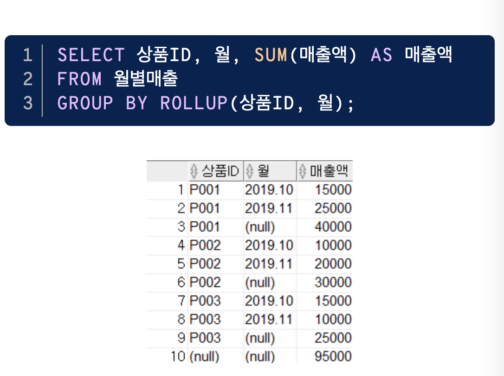
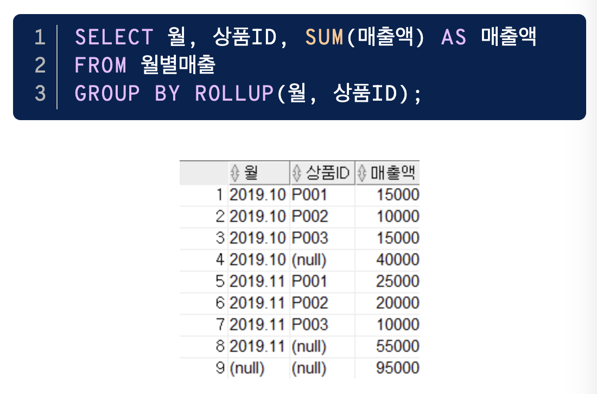
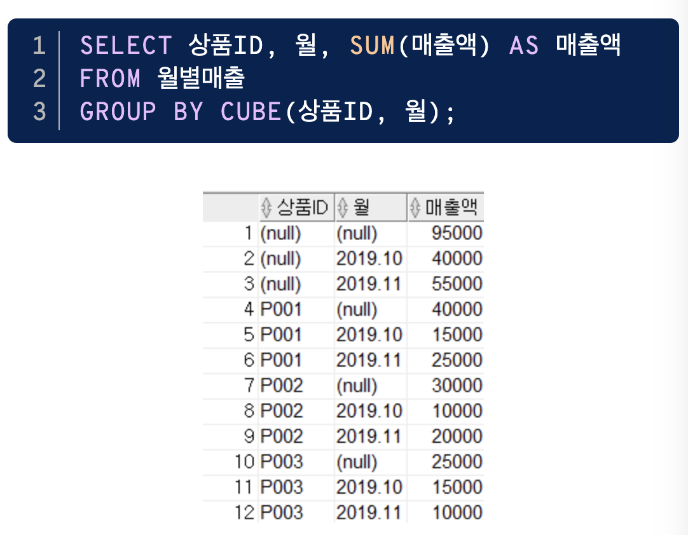
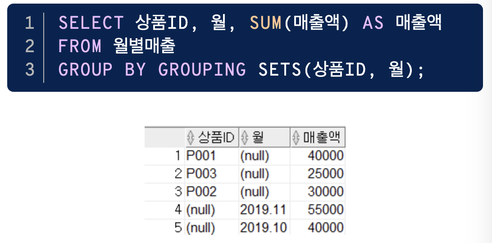
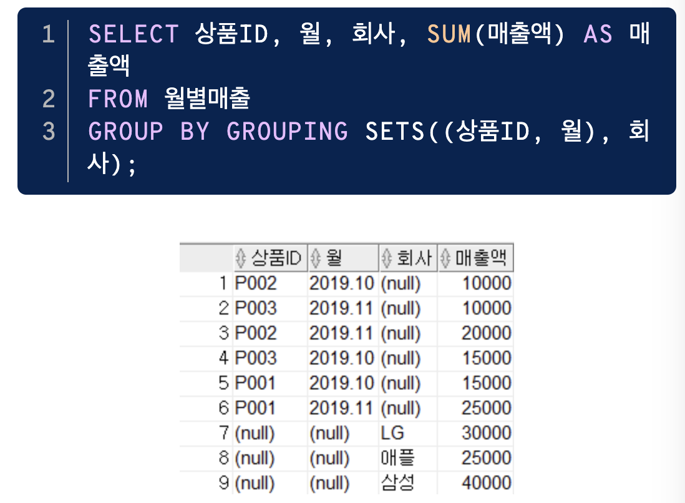
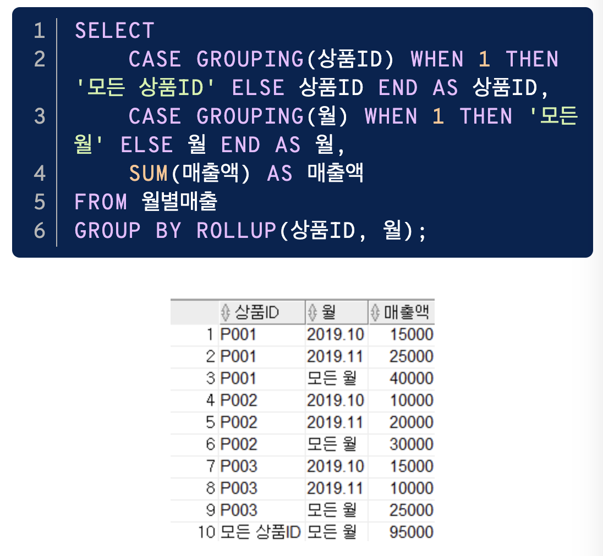
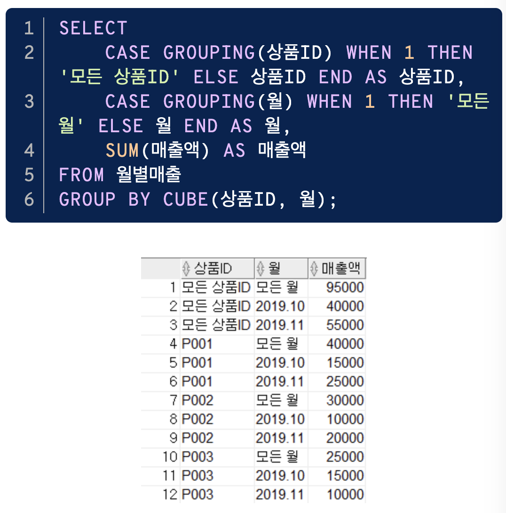
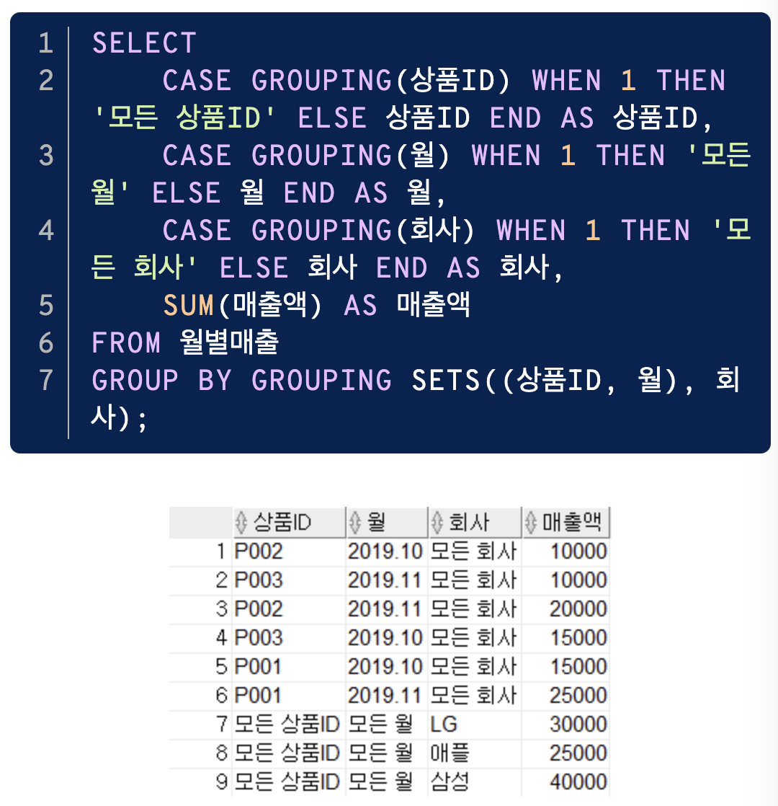
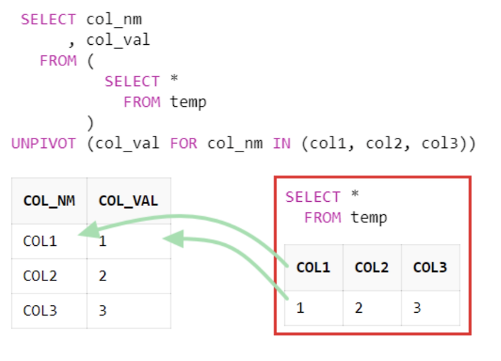

### 1. 서브 쿼리
#### 서브 쿼리란
- 하나의 SQL문 안에 포함되어 있는 또 다른 SQL문
- 서브쿼리는 메인 쿼리의 칼럼을 모두 사용할 수 있지만 메인 쿼리는 서브 쿼리의 칼럼을 사용할 수 없음
- 서브 쿼리 레벨과 상관없이 항상 메인 쿼리 레벨로 결과 집합이 생성됨
- 주의사항 :
    - 서브쿼리는 `괄호로 감싸서` 기술
    - 서브 쿼리는 `단일 행 또는 복수 행 비교 연산자와 함께 사용 가능` → `단일행 비교 연산자의 서브 쿼리 결과는 반드시 1건 이하`여야함
    - `중첩 서브 쿼리 및 스칼라 서브 쿼리`에서는 `ORDER BY 사용 불가능`

#### 동작 방식에 따른 서브 쿼리 분류
| **서브쿼리 종류** | **설명**                                                                               |
| ----------- | ------------------------------------------------------------------------------------ |
| 비연관 서브 쿼리   | - 서브 쿼리가 메인 쿼리 칼럼을 갖지 않는 형태 <br>- 주로 메인쿼리 값을 제공하기 위해 사용                              |
| 연관 서브 쿼리    | - 서브 쿼리가 메인 쿼리 칼럼을 갖는 형태<br>- 메인 쿼리가 먼저 수행되어 읽혀진 데이터를 <br>서브쿼리에서 조건이 맞는지 확인할 때 주로 사용 |

#### 단일 행 서브쿼리
- 서브 쿼리의 실행 결과가 항상 1건 이하인 서브 쿼리를 의미
- 단일 행 서브 쿼리는 단일 행 비교 연산자와 함께 사용됨
- 단일 행 비교 연산자에는 `=, <, <=, >, >=, <>` 등이 있음

#### 다중 행 서브쿼리
- 서브 쿼리의 실행 결과가 여러 건인 서브 쿼리를 의미
- 다중 행 서브 쿼리는 다중행 비교 연산자와 함께 사용
- 다중행 비교연산자 : `IN, ALL, ANY, SOME, EXISTS`

| 다중행 연산자           | 설명                                                                                                                                  |
| ----------------- | ----------------------------------------------------------------------------------------------------------------------------------- |
| `IN(서브쿼리)`        | - 서브 쿼리 결과에 존재하는 임의의 값과 동일한 값이 있는지를 의미 (Multiple OR 조건)                                                                             |
| `비교연산자 ALL(서브쿼리)` | - 서브 쿼리의 결과에 존재하는 모든 값을 만족하는 조건을 의미<br>- 비교 연산자로 '>'를 사용했다면 메인 쿼리는 서브 쿼리의 모든 결과 값을 만족해야 하므로, 서브 쿼리 결과의 최댓값보다 큰 건이 조건을 만족            |
| `비교연산자 ANY(서브쿼리)` | - 서브 쿼리의 결과에 존재하는 어느 하나의 값이라도 만족하는 조건을 의미<br>- 비교 연산자로 '>'를 사용했다면 메인 쿼리는 서브 쿼리의 값들 중 어떤 값이라도 만족하면 되므로, 서브 쿼리의 결과의 최소값보다 큰 건이 조건을 만족 |
| `EXISTS(서브쿼리)`    | - 서브 쿼리의 결과를 만족하는 값이 존재하는지 여부를 확인하는 조건을 의미<br>- 조건을 만족하는 건이 여러 건이더라도 1건만 찾으면 더이상 검색하지 않음<br>                                        |

#### 다중 칼럼 서브 쿼리
- 서브 쿼리의 결과로 여러 개의 칼럼이 반환되어, 메인 쿼리의 조건과 동시에 비교되는 것을 의미
- SQL Server에서는 지원 X
- ex) 소속팀별 키가 가장 작은 사람들의 정보를 출력하는 문제 :
```
	SELECT TEAM_ID AS 팀코드, PLAYER_NAME AS 선수명, POSITION AS 포지션, BACK_NO AS 백넘버, HEIGHT AS 키
	FROM PLAYER
	WHERE (TEAM_ID, HEIGHT) IN (SELECT TEAM_ID, MIN(HEIGHT) 
								FROM PLAYER 
								GROUP BY TEAM_ID)
	ORDER BY TEAM_ID, PLAYER_NAME;
```

#### 연관 서브 쿼리
- 연관 서브 쿼리(Correlated Subquery) : 서브 쿼리 내에 메인 쿼리 칼럼이 사용된 서브 쿼리
- ex) 선수 자신이 속한 팀의 평균키보다 작은 선수들의 정보를 출력 :
```
	SELECT B.TEAM_NAME AS 팀명, A.PLAYER_NAME AS 선수명, A.POSITION AS 포지션 , A.BACK_NO AS 백넘버, A.HEIGHT AS 키
	FROM PLAYER A, TEAM B
	WHERE A.HEIGHT < (SELECT AVG(X.HEIGHT) 
						FROM PLAYER 
						WHERE X.TEAM_ID = A.TEAM_ID 
						GROUP BY X.TEAM_ID) 
	AND B.TEAM_ID = A.TEAM_ID
	ORDER BY 선수명;
```
- EXISTS 서브 쿼리는 항상 연관 서브 쿼리로 사용됨
```
	SELECT A.STADIUM_ID AS ID, A.STADIUM_NAME AS 경기장명
    FROM STADIUM A
	WHERE EXISTS (SELECT 1 
	            FROM SCHEDULE X
		        WHERE X.STADIUM_ID = A.STADIUM_ID
                AND X.SCHE_DATE BETWEEN '20220501' AND '20220502');
```

#### 그 밖의 위치에서 사용하는 서브 쿼리
| 종류                                           | 설명                                                                                            |
| -------------------------------------------- | --------------------------------------------------------------------------------------------- |
| SELECT 절 <br>- `스칼라 서브 쿼리(Scallar Subquery)` | - SELECT절에서 사용<br>- 한 행, 한 칼럼만을 반환하는 서브 쿼리<br>- 단일 행 서브 쿼리이기 때문에 결과가 2건 이상 반환되면 SQL 문은 오류를 반환 |
| FROM 절 <br>- `인라인 뷰(Inline View)`            | - FROM절에서 사용<br>- 인라인 뷰를 사용하면 서브 쿼리의 결과를 마치 테이블처럼 사용할 수 있음<br>- 인라인 뷰는 쿼리 내에서 즉시 처리됨          |
| `HAVING 절에서의 서브 쿼리`                          | - 집계함수와 함께 사용될 때 그룹핑 된 결과에 대해 부가적인 조건을 주기 위해 사용                                               |

#### 뷰(View)란
- 테이블은 실제로 데이터를 가지고 있는 반면, 뷰(view)는 `실제 데이터를 가지고 있지 않음`
- 뷰는 단지 뷰 정의(view definition)만을 가짐
- 질의에서 뷰가 사용되면 뷰 정의를 참조해서 DBMS 내부적으로 질의를 재작성 하여 질의를 수행
- 뷰는 실제 데이터를 가지고 있지 않지만 테이블이 수행하는 역할을 수행하기 때문에 `가상 테이블(virtual table)`이라고도 함

#### 뷰의 장점
- `독립성` : 테이블 구조가 변경되어도 뷰를 사용하는 응용 프로그램은 변경하지 않아도 됨
- `편리성` : 복잡한 질의를 뷰로 생성함으로써 관련 질의를 단순하게 작성
- `보안성` : 직원의 급여정보와 같이 숨기고 싶은 정보가 존재한다면 뷰를 생성할 때 해당 컬럼을 빼고 생성해서 감출 수 있음

#### 뷰 생성
```
	CREATE VIEW   V_PLAYER_TEAM AS
	SELECT        P.PLAYER_NAME, P.POSITION, P.BACK_NO, P.TEAM_ID, T.TEAM_NAME
	FROM          PLAYER P, TEAM T
	WHERE         P.TEAM_ID = T.TEAM_ID ; 
```
- 뷰의 명칭은 "V_PLAYER_TEAM"
- `이미 존재하는 뷰를 FROM으로 참조해서 생성`할 수도 있음
```
	CREATE VIEW   V_PLAYER_TEAM_FILTER AS
	SELECT        PLAYER_NAME, POSITION, BACK_NO, TEAM_ID, TEAM_NAME
	FROM          V_PLAYER_TEAM
	WHERE         POSITION IN ('GK', 'MF') ;
```

#### 뷰 사용
```
	SELECT  PLAYER_NAME, POSITION, BACK_NO, TEAM_ID, TEAM_NAME
	FROM    V_PLAYER_TEAM
	WHERE   PLAYER_NAME LIKE '황%' ;
```

#### 뷰 제거
```
	DROP VIEW  V_PLAYER_TEAM ;
	DROP VIEW  V_PLAYER_TEAM_FILTER ; 
```

### 2. 집합 연산자
#### 집합 연산자란
- `JOIN을 이용하지 않고 연관된 데이터를 조회`하는 방법 -> `집합 엽산자(Set Operator)`를 사용하는 것
- 집합 연산자는 여러 개의 질의 결과를 나열해서 결합하는 방식
- `서로 다른 테이블에서 유사한 형태의 결과를 반환하는 것을 하나의 결과로 합칠 때` 사용
- 집합 연산자를 사용하려면 `SELECT 절의 컬럼 수가 동일하고 데이터 타입이 호환 가능`해야 함

#### 집합 연산자 종류
 
1) `UNION` : 여러 개의 SQL문의 결과에 대한 합집합. 결과에서 모든 중복된 행은 하나의 행으로 만듦
2) `UNION ALL` : 여러 개의 SQL문의 결과에 대한 합집합. 중복된 행도 그대로 결과로 표시. 즉, 단순히 결과만 합쳐놓은 것. 개별 SQL문의 결과가 서로 중복되지 않는 경우, UNION과 결과가 동일 (결과의 정렬 순서에는 차이가 있을 수 있음)
3) `INTERSECT` : 여러 개의 SQL문의 결과에 대한 교집합. 중복된 행은 하나의 행으로 만듦
4) `EXCEPT(MINUS)` : 앞의 SQL문의 결과에서 뒤의 SQL문의 결과에 대한 차집합(`앞에서 뒤의 결과를 빼는 것`). 중복된 행은 하나의 행으로 만듦

#### 집합연산자의 특성
```
	// 집합 연산자의 SQL문 형태
	SELECT 컬럼명1, 컬럼명2, ...
	FROM 테이블1
	
	집합 연산자

	SELECT 컬럼명1, 컬럼명2, ... 
	FROM 테이블2 ;

	// 예시
	SELECT PLAYER_NAME 선수명, BACK_NO 백넘버 
	FROM PLAYER 
	WHERE TEAM_ID = 'K02' 
	
	UNION 
	
	SELECT PLAYER_NAME 선수명, BACK_NO 백넘버 
	FROM PLAYER 
	WHERE TEAM_ID = 'K07' 
	ORDER BY 1 ;
```
- 집합 연산자는 사용상의 제약조건만 만족한다면 어떤 형태의 SELECT 문이라도 이용 가능하며, 여러 개의 SELECT문을 연결하는 것에 지나지 않음
- `ORDER BY`는 집합 연산을 적용한 최종 결과에 대한 정렬 처리이므로 `가장 마지막 줄에 한번만 기술`
- UNION의 경우 IN 또는 OR  연산자로 대체해도 됨. 하지만, IN, OR를 사용하게 되면 결과 표시 순서가 달라질 수 있으므로 ORDER BY를 이용해서 정렬 순서를 정의해야 함

- ex1) 팀이 K02  이면서 포지션이 골키퍼인 선수를 출력 : 
	- UNION은 결과에서 중복이 존재할 경우 중복을 제외시키지만, UNION ALL은 중복을 제외하지 않으므로 갯수 차이가 남
```
		SELECT PLAYER_NAME 선수명, BACK_NO 백넘버, POSITION 포지션 
		FROM PLAYER 
		WHERE TEAM_ID = 'K02' 
		
		UNION 
		
		SELECT PLAYER_NAME 선수명, BACK_NO 백넘버, POSITION 포지션 
		FROM PLAYER 
		WHERE POSITION = 'GK' ;
	
		-- 이 결과의 행의 갯수는 88개
	
		SELECT PLAYER_NAME 선수명, BACK_NO 백넘버, POSITION 포지션 
		FROM PLAYER 
		WHERE TEAM_ID = 'K02' 
		
		UNION ALL
		
		SELECT PLAYER_NAME 선수명, BACK_NO 백넘버, POSITION 포지션 
		FROM PLAYER 
		WHERE POSITION = 'GK' ;
	
		-- 이 결과의 행의 갯수는 92개	
```

- ex2) 포지션별 평균 키와 팀별 평균키를 구하기 : 
	- `그룹함수에서 집합 연산자를 사용하는 것이 가능`
	- 실제 테이블에는 존재하지 않지만, 결과 행을 구분하기 위해 SELECT 절에 '구분코드'를 추가할 수도 있음 (SELECT 절에 임의의 컬럼을 추가하는 것은 다른 모든 SQL문에서 적용 가능)
	- 집합 연산자의 결과를 표시할 때에는 `첫번째 SQL 문에서 사용된 HEADING (ALIAS)이 적용됨` (첫번째 SELECT 절에서는 '포지션', 두번째 SELECT 절에서는 '팀명' 이 사용되었는데 결과에는 '포지션' 으로 표시됨)
```
		SELECT 'P'구분코드, POSITION 포지션, AVG(HEIGHT) 평균키 
		FROM PLAYER 
		GROUP BY POSITION 
		
		UNION 
		
		SELECT 'T'구분코드, TEAM_ID 팀명, AVG(HEIGHT) 평균키 
		FROM PLAYER 
		GROUP BY TEAM_ID 
		ORDER BY 1 ;
```

- ex3) K02 팀이면서 미드필더가 아닌 선수들의 차집합 구하기 : 
```
	SELECT PLAYER_NAME 선수명, BACK_NO 백넘버, POSITION 포지션 
	FROM PLAYER 
	WHERE TEAM_ID = 'K02' 
	
	MINUS 
	
	SELECT PLAYER_NAME 선수명, BACK_NO 백넘버, POSITION 포지션 
	FROM PLAYER 
	WHERE POSITION = 'MF' 
	ORDER BY 1, 2, 3;

	-- SQL SERVER 에서는 EXCEPT를 사용 ORACLE에서는 MINUS를 사용
```

### 3. 그룹 함수
#### 분석 함수
- SQL 표준은 데이터 분석을 위해 다음 세 가지 함수를 정의 : 집계 함수, 그룹 함수, 윈도우 함수
- `집계 함수(AGGREGATE FUNCTION)` :
	- 그룹 집계 함수(GROUP AGGREGATE FUNCTION)라고도 부르는 그룹 함수의 한 부류
	- `COUNT, SUM, AVG, MAX, MIN` 등이 포함
- `그룹 함수(GROUP FUNCTION)` : 
	- 리포트를 작성할 때 사용하기 좋은 함수
	- 소계, 중계, 합계, 총 합계 등을 구할 수 있음
	- 소그룹 간의 소계를 계산하는 `ROLLUP`, 다차원적 소계를 할 수 있는 `CUBE`, 특정 항목의 소계를 할 수 있는 `GROUPING SETS` 함수가 있음
- `윈도우 함수(WINDOW FUNCTION)` : 
	- 분석 함수(ANALYTIC FUNCTION)나 순위 함수(RANK FUNCTION)로도 알려져 있음
	- RANK(순위) function, AGGREGATE(집계) function, 행 순서 관련 함수

#### ROLLUP
- ROLLUP 에 지정된 그룹핑 컬럼이 N개 라고 하면 `N+1`의 소계(subtotal)가 생성
- 첫번째 인자에 대한 소계(SUBTOTAL)와 총계(GRAND TOTAL)의 결과가 나오기 때문에 `나열된 컬럼의 순서가 변경되면 수행 결과도 변경됨`
- 롤업의 경우 계층 간 집계에 대해서는 레벨별 순서를 정렬하지만, 계층 내 그룹 바이 수행 시 생성되는 표준 집계에 대해서는 별도 정렬을 지원하지 않음. 정렬을 원하면 ORDER BY를 사용

- ROLLUP의 원리 : 
	1) `ROLLUP의 인자로 들어온 칼럼을 오른쪽부터 하나씩 빼면서 GROUP을 만듦`
	2) "()"의 의미는 GROUP이 없는 즉, 전체에 대한 결과를 출력한다는 뜻
	3) 괄호로 묶여져 있는 컬럼은 하나로 봄
	4) ROLLUP 이전에 일반 컬럼과 GROUP BY 한다면, 일반 컬럼은 끝까지 남음
	- https://myjamong.tistory.com/191 참고

- 예시 : 
```
	SELECT    DNAME, JOB, COUNT(*) "TOTAL EMPL", SUM(SAL) "TOTAL SAL"
	FROM      EMP, DEPT
	WHERE     DEPT.DEPTNO = EMP.DEPTNO
	GROUP BY  ROLLUP (DNAME, JOB)
```
- 그룹핑 컬럼인 DNAME, JOB에 대해서 다음과 같은 LEVEL의 추가 집계가 생성 :
	- L1 - 그룹 바이 수행시 성생되는 표준 집계 (DNAME 별 JOB 그룹 조합)
	- L2 - DNAME 별 모든 JOB의 SUBTOTAL 
	- L3 - GRAND TOTAL 

 
 

#### CUBE
- 그룹핑 컬럼이 가질 수 있는 모든 경우의 수에 대하여 소계(SUBTOTAL)과 총계(GRAND TOTAL)을 생성
- 결과에 대한 정렬이 필요한 경우 ORDER BY절에 명시적으로 정렬 컬럼이 표시되어야함
- 그룹핑 컬럼의 개수를 N이라고 한다면 `2의 N승`의 소계(SUBTOTAL)을 생성
- ROLLUP과 달리 평등 관계이므로 `인자의 순서가 달라도 결과는 같음`

 

#### GROUPING SETS
- GROUPING SETS는 표시된 인수들에 대한 개별 집계를 구할 수 있음
- CUBE와 마찬가지로 결과에 대한 정렬이 필요한 경우 ORDER BY절에 명시적으로 정렬 컬럼이 표시 되야함
- ROLLUP과 달리 평등 관계이므로 `인자의 순서가 달라도 결과는 같음`
- CUBE의 인자에 대한 모든 가능한 집합을 GROUPING SETS로 표현하면 동일한 결과가 출력됨
```
	SELECT 상품ID, 월, SUM(매출액) AS 매출액  
	FROM 월별매출  
	GROUP BY CUBE(상품ID, 월);
	
	SELECT 상품ID, 월, SUM(매출액) AS 매출액  
	FROM 월별매출  
	GROUP BY GROUPING SETS((상품ID), (월), (상품ID, 월), ());
```

 
  

#### GROUPING
- GROUPING 함수는 직접 그룹별 집계를 구하지는 않지만 앞서 말한 ROLLUP, CUBE, GROUPING SETS를 지원하는 역할
- `집계가 계산된 결과에 GROUPING(표현식) = 1`이 되며, 그 외에는 `GROUPING(표현식) = 0`이 됨

 
  
   
   
### 4. 윈도우 함수

#### 윈도우 함수란
- 행과 행 간의 관계를 쉽게 정의하기 위해 만든 함수
- 분석 함수나 순위 함수로도 알려져 있음
- 윈도우 함수는 기존에 사용하던 집계 함수도 있고, 새로 윈도우 함수 전용으로 만들어진 기능도 있음
- 윈도우 함수는 다른 함수와 달리 중첩해서 사용은 못하지만, 서브쿼리에는 사용할 수 있음

#### 윈도우 함수 문법
```
-- 윈도우 함수에는 OVER 문구가 키워드로 필수 포함

SELECT WINDOW_FUNCTION (ARGUMENTS) 
OVER ([PARTITION BY 칼럼] [ORDER BY 절] [WINDOWING 절]) 
FROM 테이블 명;
```
- WINDOW_FUNCTION : 윈도우 함수 
- ARGUMENTS(인수) : 함수에 따라 0 ~ N개 인수가 지정될 수 있음
- PARTITION BY 절 : 전체 집합을 기준에 의해 소그룹으로 나눌 수 있음
- ORDER BY 절 : 어떤 항목에 대해 순위를 지정할 지 order by 절을 기술
- WINDOWING 절 : 함수의 대상이 되는 행 기준의 범위를 강력하게 지정할 수 있음 (sql server 에서는 지원하지 않음)

#### 윈도우 함수 종류
| **윈도우 함수 종류**           | 윈도우 함수                                                                                                                                                                                                                   | 설명                                                                          |
| ----------------------- | ------------------------------------------------------------------------------------------------------------------------------------------------------------------------------------------------------------------------ | --------------------------------------------------------------------------- |
| **순위(RANK) 관련 함수**      | `RANK`                                                                                                                                                                                                                   | - 특정항목 및 파티션에 대해서 순위를 계산<br>- `동일한 순위는 동일한 값이 부여`                           |
|                         | `DENSE_RANK`                                                                                                                                                                                                             | - `동일한 순위를 하나의 건수로 계산`                                                      |
|                         | `ROW_NUMBER`                                                                                                                                                                                                             | - `동일한 순위에 대해서 고유의 순위를 부여`                                                  |
| **집계(AGGREGATE) 관련 함수** | `SUM`                                                                                                                                                                                                                    | - 합계를 계산                                                                    |
|                         | `AVG`                                                                                                                                                                                                                    | - 평균을 계산                                                                    |
|                         | `COUNT`                                                                                                                                                                                                                  | - 행 수를 계산                                                                   |
|                         | `MAX, MIN`                                                                                                                                                                                                               | - 최대값과 최소값을 계산                                                              |
| **순서 관련 함수**            | `FIRST_VALUE`                                                                                                                                                                                                            | - 파티션에서 `가장 처음에 나오는 값`을 구함  <br>- `MIN 함수`를 사용해서 같은 결과 구할 수 있음              |
|                         | `LAST_VALUE`                                                                                                                                                                                                             | - 파티션에서 `가장 나중에 나오는 값`을 구함                                                  |
|                         | `LAG`                                                                                                                                                                                                                    | - `이전 행`을 가지고 옴                                                             |
|                         | `LEAD`                                                                                                                                                                                                                   | - 윈도우에서 `특정 위치의 행`을 가지고 옴<br>- 기본값은 1                                       |
| **비율 관련 함수**            | `CUME_DIST`                                                                                                                                                                                                              | - 파티션 전체 건수에서 현재 행보다 작거나 같은 건수에 대한 누적 백분율을 조회<br>- 누적 분포상에 위치를 0~1사이의 값을 가짐 |
|                         | `PERCENT_RANK`                                                                                                                                                                                                           | - 파티션에서 제일 먼저 나온 것을 0으로 제일 늦게 나온 것을 1로 하여 값이 아닌 행의 순서별 백분율을 조회              |
|                         | `NTILE`                                                                                                                                                                                                                  | - 파티션 별로 전체 건수를 ARGUMENT 값으로 N등분한 결과를 조회                                    |
|                         | `RATIO_TO_REPORT`                                                                                                                                                                                                        | - 파티션 내에 전체 SUM(칼럼)에 대한 행 별 칼럼 값의 백분율을 소수점까지 조회                             |
| **통계 분석 관련 함수**         | CORR, COVAR_POP, COVAR_SAMP, STDDEV, STDDEV_POP, STDDEV_SAMP, VARIANCE, VAR_POP, VAR_SAMP, REGR_(LINEAR REGRESSION), REGR_SLOPE, REGR_INTERCEPT, REGR_COUNT, REGR_R2, REGR_AVGX, REGR_AVGY, REGR_SXX, REGR_SYY, REGR_SXY |                                                                             |

### 5. Top N 쿼리
#### ROWNUM 슈도 칼럼
- Oracle의 ROWNUM은 칼럼과 비슷한 성격의 Pseudo Column으로서 SQL 처리 결과 집합의 각 행에 대해 임시로 부여되는 일련번호
- 테이블이나 집합에서 원하는 만큼의 행만 가져오고 싶을 때 WHERE 절에서 행의 개수를 제한하는 목적으로 사용
```
	// 한 건의 행만 가져오고 싶을 때 아래와 같이 사용
	SELECT PLAYER_NAME FROM PLAYER WHERE ROWNUM <= 1;
	SELECT PLAYER_NAME FROM PLAYER WHERE ROWNUM < 2;
	
	// 두 건 이상의 N 행을 가져오고 싶을 때는 출력되는 행의 한계를 지정해서 사용
	SELECT PLAYER_NAME FROM PLAYER WHERE ROWNUM <= N;
	SELECT PLAYER_NAME FROM PLAYER WHERE ROWNUM < N+1;
```

- ex) 사원 테이블에서 급여가 높은 3명만 내림차순으로 출력 :
```
	-- [예제] Oracle 
	SELECT ENAME, SAL 
	FROM (SELECT ENAME, SAL FROM EMP ORDER BY SAL DESC) 
	WHERE ROWNUM <= 3; 
	
	-- [출력 화면] 
	ENAME SAL 
	----- ---- 
	KING  5000 
	SCOTT 3000 
	FORD  3000
```

#### TOP 절
- SQL Server는 TOP절을 사용해 결과 집합으로 출력되는 행의 수를 제한할 수 있음
```
	TOP (Expression) [PERCENT] [WITH TIES]
```
- `Expression` : 반환할 행 수를 지정하는 숫자
- `PERCENT` : 쿼리 결과 집합에서 처음 Expression%의 행만 반환됨을 나타냄
- `WITH TIES` : ORDER BY 절이 지정된 경우에만 사용할 수 있으며, TOP N(PERCENT)의 마지막 행과 같은 값이 있는 경우 추가 행이 출력되도록 지정할 수 있음 (동일 수치의 데이터를 추가로 더 추출)

- ex1) 사원 테이블에서 급여가 높은 2명을 내림차순으로 출력 :
```
	SELECT TOP(2) ENAME, SAL FROM EMP ORDER BY SAL DESC;
```
- ex2) 사원 테이블에서 급여가 높은 2명을 내림차순으로 출력, 같은 급여를 받는 사원이 있으면 같이 출력 :
```
	SELECT TOP(2) WITH TIES ENAME, SAL FROM EMP ORDER BY SAL DESC;
```

#### ROW LIMITING 절
- Oracle은 12.1 버전, SQL Server는 2012 버전부터 ROW LIMITING 절로 Top N 쿼리 작성 가능
- ROW LIMITING 절은 ANSI 표준 SQL 문법
- ROW LIMITING 절은 ORDER BY 절 다음에 기술하며, ORDER BY 절과 함께 수행 
- ROW와 ROWS는 구분하지 않아도 됨
```
	[OFFSET offset {ROW | ROWS}] 
	[FETCH {FIRST | NEXT} [{rowcount | percent PERCENT}] {ROW | ROWS} {ONLY | WITH TIES}]
```
- `OFFSET offset` : 건너뛸 행의 개수를 지정
- `FETCH` : 반환할 행의 개수나 백분율을 지정
- `ONLY` : 지정된 행의 개수나 백분율만큼 행을 반환
- `WITH TIES` : 마지막 행에 대한 동순위를 포함해서 반환

- 예시 :
```
	SELECT EMPNO, SAL FROM EMP ORDER BY SAL, EMPNO FETCH FIRST 5 ROWS ONLY;

	// 아래와 같이 OFFSET만 기술하면 건너뛴 행 이후의 전체 행이 반환
	SELECT EMPNO, SAL FROM EMP ORDER BY SAL, EMPNO OFFSET 5 ROWS;
```

### 6. 계층형 질의와 셀프 조인
#### 계층형 질의 (Hierarchical Query)
- 계층형 데이터를 조회할 때 사용하는 쿼리
- 계층형 데이터란, 동일 테이블에 상위와 하위 데이터가 포함된 데이터를 의미 (ex. 사원-관리자 테이블)

#### 오라클 계층형 질의
```
	SELECT ... 
	FROM 테이블 
	WHERE condition AND condition... 
	START WITH condition 
	CONNECT BY [NOCYCLE] condition AND condition... 
	[ORDER SIBLINGS BY column, column, ...]
```
- `START WITH 절` : `계층 구조 전개의 시작 위치`를 저장하는 구문. 루트를 지정함
- `CONNECT BY 절` : `다음에 전개될 자식 데이터`를 지정하는 구문. 자식 데이터는 CONNECT BY 절에 주어진 조건을 만족해야 함 (조인)
- `PRIOR` : CONNECT BY 절에 사용되며, 현재 읽은 칼럼을 지정함
	- `PRIOR 자식 = 부모` 형태를 사용 : 계층 구조에서 부모 데이터에서 자식 데이터 (`부모 -> 자식`) 방향으로 전개하는 `순방향 전개`
	- `PRIOR 부모 = 자식` 형태를 사용 : 반대로 자식 데이터에서 부모 데이터(`자식 -> 부모`) 방향으로 전개하는 `역방향 전개`
- `NOCYCLE` : 
	- 데이터를 전개하면서 `이미 나타났던 동일한 데이터가 전개 중에 다시 나타난다`면 이것을 가리켜 `사이클(cycle)`이 형성되었다고 말함
	- 사이클이 발생한 데이터는 런타임 오류가 발생. 그렇지만 NOCYCLE 를 추가하면 `사이클이 발생한 이후의 데이터는 전개하지 않음`
- `ORDER SIBLINGS BY` : 형제 노드(동일 Level) 사이에서 정렬을 수행
- WHERE : 모든 전개를 수행한 후에 지정된 조건을 만족하는 데이터만 추출

- 오라클은 계정형 질의를 사용할 때 다음과 같은 `가상 컬럼(Pseudo Column)`을 제공 :
	1) `LEVEL` : `루트 데이터면 1`, 그 하위 데이터면 2. 리프(leaf)데이터까지 `1씩 증가`
	2) `CONNECT_BY_ISLEAF` : 전개 과정에서 해당 데이터가 `리프 데이터면 1`, `그렇지 않으면 0`이다.
	3) `CONNECT_BY_ISCYCLE` : 전개 과정에서 자식을 갖는데, `해당 데이터가 조상으로서 존재하면 1`, `그렇지 않으면 0`이다. 여기서 조상이란 자신으로부터 루트까지의 경로에 존재하는 데이터를 말한다. `CYCLE 옵션을 사용했을 때만 사용 가능`하다.

- 오라클은 계층형 질의를 사용할 때 다음과 같은 함수를 제공 : 
	1) `SYS_CONNECT_BY_PATH` : `루트 데이터부터 현재 전개할 데이터까지의 경로`를 표시. `SYS_CONNECT_BY_PATH(컬럼, 경로분리자)` 로 사용
	2) `CONNECT_BY_ROOT` : `현재 전개할 데이터의 루트 데이터`를 표시. 단항 연산자. `CONNECT_BY_ROOT 컬럼` 으로 사용

#### 계층형 질의 예제
 ```
	 // 순방향 전개 (관리자 -> 사원 방향의 전개)
	 SELECT LEVEL, EMPNO, MGR, CONNECT_BY_ISLEAF 리프 
	 FROM EMP 
	 START WITH MGR IS NULL 
	 CONNECT BY PRIOR EMPNO = MGR ;
 ```

 

```
	// 역방향 전개 (사원 -> 관리자 방향의 전개)
	SELECT LEVEL, EMPNO, MGR, CONNECT_BY_ISLEAF 리프
	FROM EMP 
	START WITH EMPNO = '7876' 
	CONNECT BY PRIOR MGR = EMPNO ;
```

 

```
	// 함수 사용 예제 (SYS_CONNECT_BY_PATH)
	SELECT 
		CONNECT_BY_ROOT(EMPNO) 루트사원, 
		SYS_CONNECT_BY_PATH(EMPNO, '/') 경로, 
		EMPNO 사원, 
		MGR 관리자, 
		ENAME 이름 
	FROM EMP 
	START WITH MGR IS NULL 
	CONNECT BY PRIOR EMPNO = MGR ;
```

 

#### 셀프 조인(SELF JOIN)
- 동일 테이블 사이의 조인. FROM 절에 동일 테이블이 두 번 이상 나타남
- 같은 테이블끼리 조인하는 것이므로 `테이블 별칭(ALIAS)을 꼭 사용`해야 함
- 예시 : 
	- 사원이라는 테이블에는 사원과 관리자가 모두 하나의 사원 개념으로 동일시하여 같이 입력되어있음
	- 이것을 이용해서 "자신과 상위, 차상위 관리자를 같은 줄에 표시하라"는 문제를 셀프 조인을 이용해서 풀 수 있음
```
	SELECT E1.ENAME 사원, E1.MGR 관리자, E2.MGR 차상위_관리자 
	FROM EMP E1, EMP E2 
	WHERE E1.MGR = E2.EMPNO 
	ORDER BY E2.MGR DESC, E1.MGR, E1.EMPNO

	// 관리자가 존재하지 않는 데이터까지 모두 표시하려면 아래처럼
	SELECT E1.ENAME 사원, E1.MGR 관리자, E2.MGR 차상위_관리자 
	FROM EMP E1 LEFT OUTER JOIN EMP E2 
	ON (E1.MGR = E2.EMPNO) 
	ORDER BY E2.MGR DESC, E1.MGR, E1.EMPNO
```

### 7. PIVOT 절과 UNPIVOT 절
- PIVOT은 회전시킨다는 의미. `PIVOT 절`은 `행을 열로 회전`시키고, `UNPIVOT 절`은 `열을 행으로 회전`

#### PIVOT 절
```
	PIVOT [XML] 
		(aggregate_function (expr) [[AS] alias] 
		[,aggregate_function (expr) [[AS] alias]]... 
		FOR {column | (column [, column]...)} 
		IN ({{{expr | (expr [, expr]...)} [[AS] alias]}... 
			| subquery 
			| ANY [, ANY]... 
			}) 
		)
```
- `aggregate_function` : 집계할 열을 지정
- `FOR` : PIVOT 할 열을 지정
- `IN` : PIVOT 할 열 값을 지정
- PIVOT 절은 집계함수와 FOR절에 지정되지 않은 열을 기준으로 집계되기 때문에 인라인 뷰를 통해 사용할 열을 지정해야 함
- 예시 : 
```
// PIVOT 절을 사용한 쿼리
SELECT *
FROM (SELECT JOB, DEPTNO, SAL FROM EMP)
PIVOT (SUM (SAL) FOR DEPTNO IN (10, 20, 30) 
ORDER BY 1; 

// [출력 화면] 
JOB       10      20      30 
----      ---    ----    --- 
ANALYST          6000 
CLERK     1300   1900    950 
MANAGER   2450   2975    2850 
PRESIDENT 5000 
SALESMAN                 5600
```

#### UNPIVOT 절
```
	UNPIVOT [{INCLUDE | EXCLUDE} NULLS] 
		( {column | (column [, col]...)} 
		FOR {column | (column [, col]...)} 
		IN {column | (column [, col]...)} [AS {literal | (literal [, literal]...)}] 
		[, {column | (column [, col]...)} [AS {literal | (literal [, literal]...)}]]... 
		) 
	) 
	
	// 작성법 예시 
	SELECT * FROM ( 피벗 대상 쿼리문 ) 
	UNPIVOT ( 컬럼별칭(값) FOR 컬럼별칭(열) IN (피벗열명 AS '별칭', ... )
```
- UNPIVOT column : UNPIVOT된 값이 들어갈 열을 지정
- FOR : UNPIVOT된 값을 설명할 값이 들어갈 열을 지정
- IN : UNPIVOT할 열과 설명할 값의 리터럴 값을 지정

 

### 8. 정규 표현식
- 정규 표현식(regular expression)은 문자열의 규칙을 표현하는 검색 패턴으로 주로 문자열 검색과 치환에 사용

#### 기본문법
| **연산자**                                                                                                                               | **설명**                          |
| ------------------------------------------------------------------------------------------------------------------------------------- | ------------------------------- |
| `.`                                                                                                                                   | (dot) 모든 문자와 일치(newline 제외)     |
| \|                                                                                                                                    | (or) 대체 문자를 구분                  |
| `\`                                                                                                                                   | (backslash) 다음 문자를 일반 문자로 취급    |
| **^**                                                                                                                                 | (carrot) 문자열의 시작                |
| **$**                                                                                                                                 | (dollar) 문자열의 끝                 |
| **수량사(quantifier) 패턴을 최대로 일치시키는 탐욕적(greedy) 방식으로 동작  <br>/<br>PERL 정규 표현식 연산자는 수량사와 유사하게 동작, 패턴을 최소로 일치시키는 비탐욕적 (nongreedy) 방식으로 동작** |                                 |
| **? / ??**                                                                                                                            | 0회 또는 1회 일치                     |
| *** / *?**                                                                                                                            | 0회 또는 그 이상의 횟수로 일치              |
| **+ / +?**                                                                                                                            | 1회 또는 그 이상의 횟수로 일치              |
| **{M} / {M}?**                                                                                                                        | m회 일치                           |
| **{m,} / {m,}?**                                                                                                                      | 최소 m회 일치                        |
| **{,m} / {,m}?**                                                                                                                      | 최대 m회 일치                        |
| **{m,n} / {m,n}?**                                                                                                                    | 최소 m회, 최대 n회 일치                 |
| **(expr)**                                                                                                                            | 괄호 안의 표현식을 하나의 단위로 취급           |
| **\n**                                                                                                                                | n번째 서브 표현식과 일치, n은 1에서 9 사이의 정수 |
| **[a-z]**                                                                                                                             | a부터 z중 한 문자와 일치                 |
| **[^a-z]**                                                                                                                            | a부터 z에 포함되지 않는 문자               |
