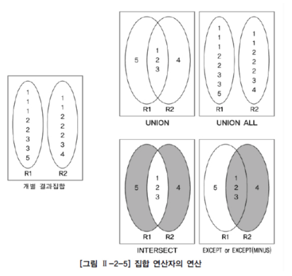
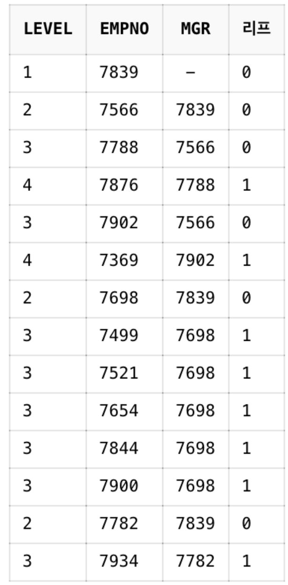
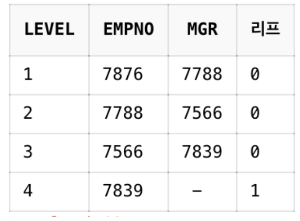
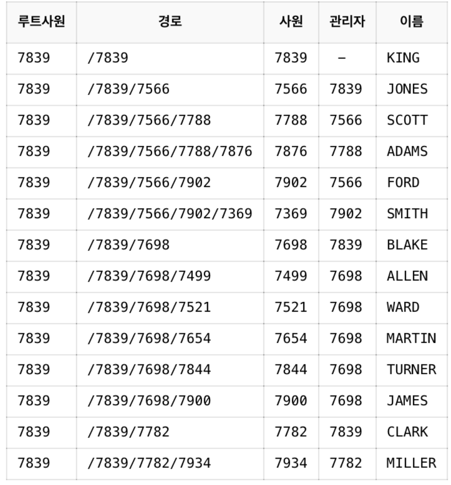

```table-of-contents
```

### 1. 서브 쿼리
#### 서브 쿼리란
- 하나의 SQL문 안에 포함되어 있는 또 다른 SQL문
- 서브쿼리는 메인 쿼리의 칼럼을 모두 사용할 수 있지만 메인 쿼리는 서브 쿼리의 칼럼을 사용할 수 없음
- 서브 쿼리 레벨과 상관없이 항상 메인 쿼리 레벨로 결과 집합이 생성됨
- 주의사항 :
    - 서브쿼리는 `괄호로 감싸서` 기술
    - 서브 쿼리는 `단일 행 또는 복수 행 비교 연산자와 함께 사용 가능` → `단일행 비교 연산자의 서브 쿼리 결과는 반드시 1건 이하`여야함
    - `중첩 서브 쿼리 및 스칼라 서브 쿼리`에서는 `ORDER BY 사용 불가능`

#### 동작 방식에 따른 서브 쿼리 분류
| **서브쿼리 종류** | **설명**                                                                               |
| ----------- | ------------------------------------------------------------------------------------ |
| 비연관 서브 쿼리   | - 서브 쿼리가 메인 쿼리 칼럼을 갖지 않는 형태 <br>- 주로 메인쿼리 값을 제공하기 위해 사용                              |
| 연관 서브 쿼리    | - 서브 쿼리가 메인 쿼리 칼럼을 갖는 형태<br>- 메인 쿼리가 먼저 수행되어 읽혀진 데이터를 <br>서브쿼리에서 조건이 맞는지 확인할 때 주로 사용 |

#### 단일 행 서브쿼리
- 실행 결과가 항상 1건 이하인 서브 쿼리
- 단일 행 비교 연산자(=,<,≤,>,≥,<>,...)와 함께 사용

#### 다중 행 서브쿼리
- 실행 결과가 여러 건인 서브 쿼리
- 다중행 비교연산자 : 

| 다중행 연산자         | 설명                                                           |
| --------------- | ------------------------------------------------------------ |
| IN(서브쿼리)        | 서브 쿼리 결과에 존재하는 임의의 값과 동일한 값이 있는지                             |
| 비교연산자 ALL(서브쿼리) | 서브 쿼리 결과에 존재하는 모든 값을 만족하는지                                   |
| 비교연산자 ANY(서브쿼리) | 서브 쿼리의 결과에 존재하는 어느 하나의 값이라도 만족하는지                            |
| EXISTS(서브쿼리)    | 서브 쿼리의 결과를 만족하는 값이 존재하는지 여부 확인  <br>조건 만족하는 1건만 찾으면 더이상 검색 X |

#### 다중 칼럼 서브 쿼리
- 실행 결과로 여러 개의 칼럼 반환
- 메인 쿼리 조건과 동시에 비교되는 것
- SQL Server에서는 지원 X

#### 그 밖의 위치에서 사용하는 서브 쿼리
- 스칼라 서브 쿼리 : 
	- SELECT절에서 사용
	- 한 행, 한 칼럼만을 반환하는 서브 쿼리 → 결과가 2건 이상 반환되면 오류 반환
- 인라인 뷰 :
	- FROM절에서 사용
	- 서브 쿼리 결과를 테이블처럼 사용가능
- Having 절에서의 서브 쿼리 : 
	- 집계함수와 함께 사용될 때 그룹핑 된 결과에 대해 부가적인 조건을 주기 위해 사용

#### 뷰(View)란
- 테이블은 실제로 데이터를 가지고 있는 반면, 뷰(view)는 실제 데이터를 가지고 있지 않음
- 뷰는 단지 뷰 정의(view definition)만을 가짐
- 질의에서 뷰가 사용되면 뷰 정의를 참조해서 DBMS 내부적으로 질의를 재작성 하여 질의를 수행
- 뷰는 실제 데이터를 가지고 있지 않지만 테이블이 수행하는 역할을 수행하기 때문에 가상 테이블(virtual table)이라고도 함

#### 뷰의 장점
- 독립성 : 테이블 구조가 변경되어도 뷰를 사용하는 응용 프로그램은 변경하지 않아도 됨
- 편리성 : 복잡한 질의를 뷰로 생성함으로써 관련 질의를 단순하게 작성
- 보안성 : 직원의 급여정보와 같이 숨기고 싶은 정보가 존재한다면 뷰를 생성할 때 해당 컬럼을 빼고 생성해서 감출 수 있음

#### 뷰 생성
```
	CREATE VIEW   V_PLAYER_TEAM AS
	SELECT        P.PLAYER_NAME, P.POSITION, P.BACK_NO, P.TEAM_ID, T.TEAM_NAME
	FROM          PLAYER P, TEAM T
	WHERE         P.TEAM_ID = T.TEAM_ID ; 
```
- 뷰의 명칭은 "V_PLAYER_TEAM"
- `이미 존재하는 뷰를 FROM으로 참조해서 생성`할 수도 있음
```
	CREATE VIEW   V_PLAYER_TEAM_FILTER AS
	SELECT        PLAYER_NAME, POSITION, BACK_NO, TEAM_ID, TEAM_NAME
	FROM          V_PLAYER_TEAM
	WHERE         POSITION IN ('GK', 'MF') ;
```

#### 뷰 사용
```
	SELECT  PLAYER_NAME, POSITION, BACK_NO, TEAM_ID, TEAM_NAME
	FROM    V_PLAYER_TEAM
	WHERE   PLAYER_NAME LIKE '황%' ;
```

#### 뷰 제거
```
	DROP VIEW  V_PLAYER_TEAM ;
	DROP VIEW  V_PLAYER_TEAM_FILTER ; 
```

### 2. 집합 연산자
#### 집합 연산자란
- `JOIN을 이용하지 않고 연관된 데이터를 조회`하는 방법 -> `집합 엽산자(Set Operator)`를 사용하는 것
- 집합 연산자는 여러 개의 질의 결과를 나열해서 결합하는 방식
- `서로 다른 테이블에서 유사한 형태의 결과를 반환하는 것을 하나의 결과로 합칠 때` 사용
- 집합 연산자를 사용하려면 `SELECT 절의 컬럼 수가 동일하고 데이터 타입이 호환 가능`해야 함

#### 집합 연산자 종류
 
1) `UNION` : 여러 개의 SQL문의 결과에 대한 합집합. 결과에서 모든 중복된 행은 하나의 행으로 만듦
2) `UNION ALL` : 여러 개의 SQL문의 결과에 대한 합집합. 중복된 행도 그대로 결과로 표시. 즉, 단순히 결과만 합쳐놓은 것. 개별 SQL문의 결과가 서로 중복되지 않는 경우, UNION과 결과가 동일 (결과의 정렬 순서에는 차이가 있을 수 있음)
3) `INTERSECT` : 여러 개의 SQL문의 결과에 대한 교집합. 중복된 행은 하나의 행으로 만듦
4) `EXCEPT(MINUS)` : 앞의 SQL문의 결과에서 뒤의 SQL문의 결과에 대한 차집합(`앞에서 뒤의 결과를 빼는 것`). 중복된 행은 하나의 행으로 만듦

#### 집합연산자의 특성
```
	// 집합 연산자의 SQL문 형태
	SELECT 컬럼명1, 컬럼명2, ...
	FROM 테이블1
	
	집합 연산자

	SELECT 컬럼명1, 컬럼명2, ... 
	FROM 테이블2 ;

	// 예시
	SELECT PLAYER_NAME 선수명, BACK_NO 백넘버 
	FROM PLAYER 
	WHERE TEAM_ID = 'K02' 
	
	UNION 
	
	SELECT PLAYER_NAME 선수명, BACK_NO 백넘버 
	FROM PLAYER 
	WHERE TEAM_ID = 'K07' 
	ORDER BY 1 ;
```
- 집합 연산자는 사용상의 제약조건만 만족한다면 어떤 형태의 SELECT 문이라도 이용 가능하며, 여러 개의 SELECT문을 연결하는 것에 지나지 않음
- `ORDER BY`는 집합 연산을 적용한 최종 결과에 대한 정렬 처리이므로 `가장 마지막 줄에 한번만 기술`
- UNION의 경우 IN 또는 OR  연산자로 대체해도 됨. 하지만, IN, OR를 사용하게 되면 결과 표시 순서가 달라질 수 있으므로 ORDER BY를 이용해서 정렬 순서를 정의해야 함

- ex1) 팀이 K02  이면서 포지션이 골키퍼인 선수를 출력 : 
	- UNION은 결과에서 중복이 존재할 경우 중복을 제외시키지만, UNION ALL은 중복을 제외하지 않으므로 갯수 차이가 남
```
		SELECT PLAYER_NAME 선수명, BACK_NO 백넘버, POSITION 포지션 
		FROM PLAYER 
		WHERE TEAM_ID = 'K02' 
		
		UNION 
		
		SELECT PLAYER_NAME 선수명, BACK_NO 백넘버, POSITION 포지션 
		FROM PLAYER 
		WHERE POSITION = 'GK' ;
	
		-- 이 결과의 행의 갯수는 88개
	
		SELECT PLAYER_NAME 선수명, BACK_NO 백넘버, POSITION 포지션 
		FROM PLAYER 
		WHERE TEAM_ID = 'K02' 
		
		UNION ALL
		
		SELECT PLAYER_NAME 선수명, BACK_NO 백넘버, POSITION 포지션 
		FROM PLAYER 
		WHERE POSITION = 'GK' ;
	
		-- 이 결과의 행의 갯수는 92개	
```

- ex2) 포지션별 평균 키와 팀별 평균키를 구하기 : 
	- `그룹함수에서 집합 연산자를 사용하는 것이 가능`
	- 실제 테이블에는 존재하지 않지만, 결과 행을 구분하기 위해 SELECT 절에 '구분코드'를 추가할 수도 있음 (SELECT 절에 임의의 컬럼을 추가하는 것은 다른 모든 SQL문에서 적용 가능)
	- 집합 연산자의 결과를 표시할 때에는 `첫번째 SQL 문에서 사용된 HEADING (ALIAS)이 적용됨` (첫번째 SELECT 절에서는 '포지션', 두번째 SELECT 절에서는 '팀명' 이 사용되었는데 결과에는 '포지션' 으로 표시됨)
```
		SELECT 'P'구분코드, POSITION 포지션, AVG(HEIGHT) 평균키 
		FROM PLAYER 
		GROUP BY POSITION 
		
		UNION 
		
		SELECT 'T'구분코드, TEAM_ID 팀명, AVG(HEIGHT) 평균키 
		FROM PLAYER 
		GROUP BY TEAM_ID 
		ORDER BY 1 ;
```

- ex3) K02 팀이면서 미드필더가 아닌 선수들의 차집합 구하기 : 
```
	SELECT PLAYER_NAME 선수명, BACK_NO 백넘버, POSITION 포지션 
	FROM PLAYER 
	WHERE TEAM_ID = 'K02' 
	
	MINUS 
	
	SELECT PLAYER_NAME 선수명, BACK_NO 백넘버, POSITION 포지션 
	FROM PLAYER 
	WHERE POSITION = 'MF' 
	ORDER BY 1, 2, 3;

	-- SQL SERVER 에서는 EXCEPT를 사용 ORACLE에서는 MINUS를 사용
```

### 3. 그룹 함수
#### 분석 함수
- SQL 표준은 데이터 분석을 위해 다음 세 가지 함수를 정의 : 집계 함수, 그룹 함수, 윈도우 함수
- `집계 함수(AGGREGATE FUNCTION)` :
	- 그룹 집계 함수(GROUP AGGREGATE FUNCTION)라고도 부르는 그룹 함수의 한 부류
	- COUNT, SUM, AVG, MAX, MIN 등이 포함
- `그룹 함수(GROUP FUNCTION)` : 
	- 리포트를 작성할 때 사용하기 좋은 함수
	- 소계, 중계, 합계, 총 합계 등을 구할 수 있음
	- 소그룹 간의 소계를 계산하는 ROLLUP, GROUP BY, 다차원적 소계를 할 수 있는 CUBE, 특정 항목의 소계를 할 수 있는 GROUPING SETS 함수가 있음
- `윈도우 함수(WINDOW FUNCTION)` : 
	- 분석 함수(ANALYTIC FUNCTION)나 순위 함수(RANK FUNCTION)로도 알려져 있음

#### ROLLUP
```
	SELECT 상품ID, 월, SUM(매출액) AS 매출액
	FROM 월별매출
	GROUP BY ROLLUP(상품ID, 월);
```

- ROLLUP 에 지정된 그룹핑 컬럼이 N개 라고 하면 N+1 의 subtotal 이 생성됨.

계층구조라서 인수 순서가 바뀌면 결과도 바뀌게 되므로 주의!

```
SELECT    DNAME, JOB, COUNT(*) "TOTAL EMPL", SUM(SAL) "TOTAL SAL"
FROM      EMP, DEPT
WHERE     DEPT.DEPTNO = EMP.DEPTNO
GROUP BY  ROLLUP (DNAME, JOB)
```

그룹핑 컬럼인 DNAME, JOB에 대해서 다음과 같은 LEVEL의 추가 집계가 생성된다.

- L1 - 그룹 바이 수행시 성생되는 표준 집계
- L2 - DNAME 별 모든 JOB의 SUBTOTAL 
- L3 - GRAND TOTAL 

롤업의 경우 계층 간 집계에 대해서는 레벨별 순서를 정렬하지만,

계층 내 그룹 바이 수행 시 생성되는 표준 집계에 대해서는 별도 정렬을 지원하지 않는다. 

정렬을 원하면 ORDER BY를 사용하자.


### 4. 윈도우 함수


### 5. Top N 쿼리


### 6. 계층형 질의와 셀프 조인
#### 계층형 질의 (Hierarchical Query)
- 계층형 데이터를 조회할 때 사용하는 쿼리
- 계층형 데이터란, 동일 테이블에 상위와 하위 데이터가 포함된 데이터를 의미 (ex. 사원-관리자 테이블)

#### 오라클 계층형 질의
```
	SELECT ... 
	FROM 테이블 
	WHERE condition AND condition... 
	START WITH condition 
	CONNECT BY [NOCYCLE] condition AND condition... 
	[ORDER SIBLINGS BY column, column, ...]
```
- `START WITH 절` : `계층 구조 전개의 시작 위치`를 저장하는 구문. 루트를 지정함
- `CONNECT BY 절` : `다음에 전개될 자식 데이터`를 지정하는 구문. 자식 데이터는 CONNECT BY 절에 주어진 조건을 만족해야 함 (조인)
- `PRIOR` : CONNECT BY 절에 사용되며, 현재 읽은 칼럼을 지정함
	- `PRIOR 자식 = 부모` 형태를 사용 : 계층 구조에서 부모 데이터에서 자식 데이터 (`부모 -> 자식`) 방향으로 전개하는 `순방향 전개`
	- `PRIOR 부모 = 자식` 형태를 사용 : 반대로 자식 데이터에서 부모 데이터(`자식 -> 부모`) 방향으로 전개하는 `역방향 전개`
- `NOCYCLE` : 
	- 데이터를 전개하면서 `이미 나타났던 동일한 데이터가 전개 중에 다시 나타난다`면 이것을 가리켜 `사이클(cycle)`이 형성되었다고 말함
	- 사이클이 발생한 데이터는 런타임 오류가 발생. 그렇지만 NOCYCLE 를 추가하면 `사이클이 발생한 이후의 데이터는 전개하지 않음`
- `ORDER SIBLINGS BY` : 형제 노드(동일 Level) 사이에서 정렬을 수행
- WHERE : 모든 전개를 수행한 후에 지정된 조건을 만족하는 데이터만 추출

- 오라클은 계정형 질의를 사용할 때 다음과 같은 `가상 컬럼(Pseudo Column)`을 제공 :
	1) `LEVEL` : `루트 데이터면 1`, 그 하위 데이터면 2. 리프(leaf)데이터까지 `1씩 증가`
	2) `CONNECT_BY_ISLEAF` : 전개 과정에서 해당 데이터가 `리프 데이터면 1`, `그렇지 않으면 0`이다.
	3) `CONNECT_BY_ISCYCLE` : 전개 과정에서 자식을 갖는데, `해당 데이터가 조상으로서 존재하면 1`, `그렇지 않으면 0`이다. 여기서 조상이란 자신으로부터 루트까지의 경로에 존재하는 데이터를 말한다. `CYCLE 옵션을 사용했을 때만 사용 가능`하다.

- 오라클은 계층형 질의를 사용할 때 다음과 같은 함수를 제공 : 
	1) `SYS_CONNECT_BY_PATH` : `루트 데이터부터 현재 전개할 데이터까지의 경로`를 표시. `SYS_CONNECT_BY_PATH(컬럼, 경로분리자)` 로 사용
	2) `CONNECT_BY_ROOT` : `현재 전개할 데이터의 루트 데이터`를 표시. 단항 연산자. `CONNECT_BY_ROOT 컬럼` 으로 사용

#### 계층형 질의 예제
 ```
	 // 순방향 전개 (관리자 -> 사원 방향의 전개)
	 SELECT LEVEL, EMPNO, MGR, CONNECT_BY_ISLEAF 리프 
	 FROM EMP 
	 START WITH MGR IS NULL 
	 CONNECT BY PRIOR EMPNO = MGR ;
 ```

 

```
	// 역방향 전개 (사원 -> 관리자 방향의 전개)
	SELECT LEVEL, EMPNO, MGR, CONNECT_BY_ISLEAF 리프
	FROM EMP 
	START WITH EMPNO = '7876' 
	CONNECT BY PRIOR MGR = EMPNO ;
```

 

```
	// 함수 사용 예제 (SYS_CONNECT_BY_PATH)
	SELECT 
		CONNECT_BY_ROOT(EMPNO) 루트사원, 
		SYS_CONNECT_BY_PATH(EMPNO, '/') 경로, 
		EMPNO 사원, 
		MGR 관리자, 
		ENAME 이름 
	FROM EMP 
	START WITH MGR IS NULL 
	CONNECT BY PRIOR EMPNO = MGR ;
```

 

#### 셀프 조인(SELF JOIN)
- 동일 테이블 사이의 조인. FROM 절에 동일 테이블이 두 번 이상 나타남
- 같은 테이블끼리 조인하는 것이므로 `테이블 별칭(ALIAS)을 꼭 사용`해야 함
- 예시 : 
	- 사원이라는 테이블에는 사원과 관리자가 모두 하나의 사원 개념으로 동일시하여 같이 입력되어있음
	- 이것을 이용해서 "자신과 상위, 차상위 관리자를 같은 줄에 표시하라"는 문제를 셀프 조인을 이용해서 풀 수 있음
```
	SELECT E1.ENAME 사원, E1.MGR 관리자, E2.MGR 차상위_관리자 
	FROM EMP E1, EMP E2 
	WHERE E1.MGR = E2.EMPNO 
	ORDER BY E2.MGR DESC, E1.MGR, E1.EMPNO

	// 관리자가 존재하지 않는 데이터까지 모두 표시하려면 아래처럼
	SELECT E1.ENAME 사원, E1.MGR 관리자, E2.MGR 차상위_관리자 
	FROM EMP E1 LEFT OUTER JOIN EMP E2 
	ON (E1.MGR = E2.EMPNO) 
	ORDER BY E2.MGR DESC, E1.MGR, E1.EMPNO
```

### 7. PIVOT 절과 UNPIVOT 절


### 8. 정규 표현식

