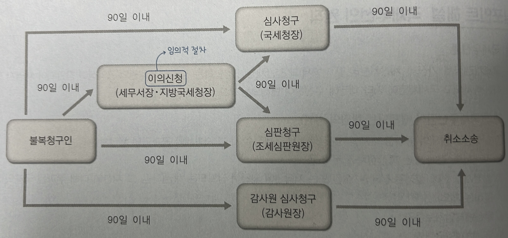

### 기간과 기한 및 서류의 송달
#### (1) 기간과 기한
- 세법(국세기본법)의 기간계산 : 원칙적으로 민법의 일반원칙에 따르나 기한에 대하여는 다음과 같은 특례를 인정함
	1) 세법에 규정하는 기한이 공휴일 or 토요일이거나 근로자의 날에 해당하는 때에는 그 `다음 날`을 기한으로 함
	2) 우편으로 서류 제출하는 경우 통신날짜 도장이 찍힌 날에 신고가 된 것으로 봄
	3) 국세정보통신망이 장애로 가동 정지된 경우 그 장애가 복구되어 신고 또는 납부를 할 수 있게 된 날의 다음 날을 기한으로 함
#### (2) 서류의 송달
- **교부송달** : 당해 행정기관의 소속공무원이 송달장소에서 송달받을 자에게 서류 교부
- **우편송달** : 서류 송달을 우편으로 할 때에는 `등기우편`에 의함
- **전자송달** : 정보통신망을 이용한 송달은 서류의 송달을 받아야 할 자가 신청하는 경우에 한 함
- **공시송달** : 다음의 경우, 서류의 중요 내용을 공고한 날로부터 `14일`이 경과함으로써 서류가 송달된 것으로 봄
	1) 송달장소가 국외에 있고 송달이 곤란한 때
	2) 송달장소가 분명하지 아니한 때
	3) 등기송달 또는 2회 이상 교부송달하였으나 수취인 부재로 확인되어 납부기한 내에 송달이 곤란한 때

### 납세의무의 성립과 확정
#### (1) 납세의무의 성립
- 각 세법이 규정하고 있는 `과세요건 (= 납세의무자, 과세물건, 과세표준, 세율)`이 충족될 때 성립
- 각 세목별 납세의무의 **성립시기**
	- 소득세, 법인세, 부가가치세 : 과세기간이 끝나는 때
	- 상속세 : 상속이 개시되는 때
	- 증여세 : 증여에 의해 재산을 취득하는 때
	- 인지세 : `과세문서를 작성하는 때` (인지를 첩부하는 때 x. 인지세는 과세문서 작성 시에 납세의무가 성립하고 동시에 확정)
	- 증권거래세 : 매매거래가 확정되는 때
	- 종합부동산세 : 과세기준일
	- 원청징수하는 소득세/법인세 : 소득금액/수입금액을 지급하는 때
#### (2) 납세의무의 확정
- 과세요건의 충족으로 성립한 추상적 납세의무를 구체적 납세의무로 **확정**하는 절차
- 신고에 의한 확정, 부과에 의한 확정, 납세의무가 성립하는 때에 특별한 절차 없이 확정되는 자동확정으로 구분
	- `신고확정` : 소득세, 법인세, 부가가치세, 증권거래세, 교육세, 개별소비세 등 대부분의 세목
	- `부과확정` : 상속세, 중여세 등
	- `자동확정` : 인지세, 원청징수하는 소득세 및 법인세, 납세조합이 징수하는 소득세, 중간예납하는 법인세

### 납부의무의 소멸
#### (1) 납부의무의 소멸사유
1) 납부/충당/부과처분의 취소
2) `국세부과의 제척기간`(국가가 납세의무자에게 국세를 부과할 수 있는 법정기간) 만료
3) `국세징수권 소멸시효`의 완성
- `결손처분`은 소멸사유 x
- 국세징수권의 소멸시효는 납세고지/독촉/납부최고/교부청구 및 압류의 사유로 인해 시효가 중단되나, `국세부과의 제척기간은 중단되지 않음`
#### (2) 국세부과의 제척기간 (기간의 진행에 있어 중단이 적용되지 않음)

| 구분                                                              | 일반조세 | 상속/증여세   |
| --------------------------------------------------------------- | ---- | -------- |
| 사기 등 부정행위로 국세를 포탈 또는 환급받는 경우(가산세 포함)                            | 10년  | 15년      |
| 법정기한 내에 과세표준신고서를 제출하지 아니한 경우                                    | 7년   | 15년      |
| 국제거래가 수반되는 부정행위                                                 | 15년  | 15년      |
| 법정신고기한까지 상속/증여세 과세표준을 신고했으나 허위, 누락신고한 경우                        | -    | 15년      |
| 부정행위로 상속/증여세를 포탈한 경우로서 상속인이 명의이전 없이 재산가액 50억원 초가분을 취득하는 경우 등 | -    | 안 날부터 1년 |
| 기타의 경우                                                          | 5년   | 10년      |
- 부담부증여로 인한 양도소득세 부과제척기간은 상속/증여세와 동일함
#### (3) 국세징수권의 소멸시효
- 일반적인 소멸시효 : `5년` (5억원 이상 국세채권의 경우 `10년`)
- 소멸시효의 중단 : 납세고지, 독촉, 납부최고, 교부청구, 압류

### 납세의무의 확장
#### (1) 납세의무의 승계
1) 합병법인 : 법인이 합병한 경우 합병법인은 피합병법인에 부과되거나 납부할 국세, 가산세와 체납처분비를 납세할 의무를 짐
2) 상속인 : 상속이 개시된 때에 상속인은 피상속인에게 부과되거나 납부할 국세, 가산세와 체납처분비를 `상속받은 재산을 한도로` 납부할 의무를 짐
#### (2) 제2차 납세의무
- 납세의무자의 재산으로 체납처분을 하여도 체납세액에 미달하는 경우 납세의무자와 일정한 관계에 있는 자가 그 부족세액을 부담하게 하는 제도
1) 청산인 등 : 청산인과 잔여재산을 분배받은 자는 그 해산법인의 국세 등에 대해 제2차 납세의무를 짐
2) 출자자 : 법인(상장법인 제외)의 재산으로 국세 등을 충당하고 부족한 금액은 `납세의무 성립일 현재의 무한책임사원과 과점주주`가 제2차 납세의무를 짐
3) 법인 : 국세 납부기한 만료일 현재 법인의 무한책임사원과 과점주주가 당사자의 재산으로 국세 등을 충당한 후에도 부족한 금액은 무한책임사원과 과점주주의 소유주식 또는 출자지분의 매각이 어려운 경우 당해법인이 제2차 납세의무를 짐
4) 사업양수인 : 양도양수한 사업과 관련하여 `양도일 이전에 확정된` 국세 등은 사업양수인이 제2차 납세의무를 짐

### 수정신고, 경정청구 및 기한 후 신고
#### (1) 수정신고
- 대상자 : 과세표준신고서를 법정신고기한까지 제출한 자가 과소신고 or 초과환급신고한 경우
- 기한 : 관할세무서장이 과세표준과 세액을 결정/경정하여 통지하기 전 & 제척기간 경과 전까지
	- 관할세무서장이 당해 국세의 과세표준과 세액을 결정/경정하여 통지하기 전이어도 `제척기간이 경과하면 수정신고서를 제출할 수 없음`
- 효과 : 법정신고기한 경과 후 `2년` 이내에 수정신고서 제출 시 그 경과기간에 따라 과소신고 가산세 일부 경감
#### (2) 경정청구
- 대상자 : 과세표준신고서를 법정신고기한 내에 제출한 자가 과대신고 or 과소환급신고한 경우
- 기한 : 법정신고기한 경과 후 `5년` 이내
#### (3) 기한 후 신고
- 대상자 : 법정신고기한까지 `과세표준신고서를 제출하지 아니한 자` (제출한 자는 기한 후 신고 불가)
- 기한 : 관할세무서장이 해당 국세의 과세표준 및 세액을 결정하여 통지하기 전까지
- 효과 : 법정신고기한 경과 후 `6개월` 이내에 기한 후 신고서 제출 시 무신고 가산세 일부 경감

### 국세우선의 원칙
#### (1) 국세우선권
- 국세채권(국세/가산세/체납처분비 및 지방세)과 일반채권이 경합하는 경우 국세채권의 공익성이 감안되어 채권자 평등원칙이 배제되고 국세채권이 기타 채권에 우선하여 변제되는 제도
#### (2) 예외(국세우선권이 배제되는 채권의 범위)
1) 선집행 지방세와 공과금의 체납처분금액에서 국세징수 시 그 지방세와 공과금의 `체납처분비`
2) 강제집행, 경매 또는 파산절차에 든 비용
3) `법정기일 전`에 설정된 전세권/질권 또는 저당권에 의하여 담보되는 채권(다만, 그 재산에 대해 부과된 국세와 체납처분비는 제외)
	- `국세의 법정기일 전에 설정된 채권`은 국세에 우선함
4) 우선변제임차보증금
5) 우선변제임금채권

### 심사와 심판
#### (1) 심사와 심판(조세불복제도)
- 행정심판전치주의 : 행정소송을 통한 사법적 구제에 앞서 행정청 자체에 대한 시정요구인 이의신청, 심사청구, 심판청구제도를 두어 `본 절차(심사청구와 심판청구만 해당)를 거치지 아니하고는 소송을 제기할 수 없도록` 하고 있음
- 심사청구와 심판청구 중 `하나를 선택하여 제기`하여야 하며, `이의신청`은 심사청구 또는 심판청구의 전 단계로서 `생략 가능`.
- 이의신청, 심사청구, 심판청구는 처분청의 처분을 안 날로부터 `90일 이내`에 제기하여야 함

#### (2) 조세불복절차

### 우리나라 소득세 제도의 특징
#### (1) 종합과세제도 원칙
- 이자소득, 배당소득, 사업소득, 근로소득, 연금소득, 기타소득을 인별로 `종합하여 과세`
- `퇴직소득과 양도소득`은 다른 소득과 합산하지 않고 각각 `별도로 과세`
- 일정 소득은 기간별로 합산하지 않고 그 소득이 지급될 때 원천징수로 과세를 종결하는 `분리과세제도` 활용
	- 원칙적으로 `종합과세제도`를 채택하고 있으나, 일정 소득에 대하여는 합산대상에서 제외하고 별도로 과세하는 `분류과세제도` 취하고 있음
#### (2) 열거주의 과세방법 채택(소득원천설)
- `소득원천설`의 입장에 따라 구체적으로 열거한 소득만을 과세대상으로 하고 그렇지 않은 경우에는 과세대상에서 제외(=`열거주의 과세원칙`)하고 있지만, `순자산증가설`도 일부 수용하고 있음
	- `순자산증가설` : 소득의 발생원천과 상관없이 순자산을 증가시키는 것은 모두 과세대상으로 보는 개념으로서, 반복적, 경상적 소득 뿐만 아니라 우발적 일시적 소득가지도 모두 과세하는 포괄적 소득 개념. 따라서 열거되지 않은 것이라도 순자산 증가액은 원칙적으로 모두 과세
#### (3) 신고납세제도
- `신고납세제도` : 납세의무자의 신고에 의하여 조세채권이 확정되는 제도
- 납세의무자가 다음 연도 5월 1일부터 5월 31일까지 과세표준확정신고를 함으로써 소득세의 납세의무가 확정
#### (4) 개인단위주의
- 원칙 : 개인을 과세단위로 하여 소득세를 과세하는 `개인단위주의 과세`
- 예외 : 가족구성원 중 2인 이상의 공동사업으로서 손익분배비율을 허위로 정하는 등의 경우 특수관계인의 소득을 합산하여 손익분배비율이 큰 가족구성원에게 과세(`공동사업합산과세`)
#### (5) 누진과세, 원천별 차별과세 및 소득공제제도
- 부담능력에 따른 과세와 소득 재분배기능이 강조됨에 따라 `초과누진세율제도` 및 `인적공제제도` 등을 두고 있음
	- `초과누진세율제도` : 소득계급구분별로 단계가 높아질수록 점차 높은 세율을 적용하는 제도
	- `인적공제제도` : 근로자 본인 및 배우자, 생계를 같이하는 부양가족에 대해 근로자의 생계 비용 등을 고려해 일정액을 공제하는 제도
#### (6) 주소지 과세제도
- 소득발생지에 불구하고 `주소지를 납세지로` 함

### 소득세법상의 납세의무자
#### (1) 납세의무자의 구분
1) 거주자 : 국내에 주소를 두거나 183일 이상 거소를 둔 개인
2) 비거주자 : 거주자가 아닌 개인
- `국적과 무관`!
#### (2) 주소 여부의 판정

| 주소를 가진 것으로 보는 경우        | - 계속하여 183일 이상 국내에 거주할 것을 통상 필요로 하는 직업을 가진 때 - 국내에 생계를 같이하는 가족이 있고, 그 직업 및 자산상태에 비추어 계속하여 183일 이상 국내에 거주할 것으로 인정되는 때 - 외국 항해 선박 또는 항공기의 승무원으로서 통상 체재하는 장소가 국내인 경우 - 국외에서 근무하는 공무원 - 내국법인의 해외현지법인(내국법인이 100% 출자) 등에 파견된 임직원 |
| -------------------------- | -------------------------------------------------------------------------------------------------------------------------------------------------------------------------------------------------------------------------------------- |
| 국내에 주소가 없는 것으로 보는 경우 | - 국외에 거주 또는 근무하는 자가 외국국적을 가졌거나 외국법령에 의하여 그 외국에 영주권을 얻은 자로서, 국내에 생계를 같이하는 가족이 없고,                                                                                                                                                       |

